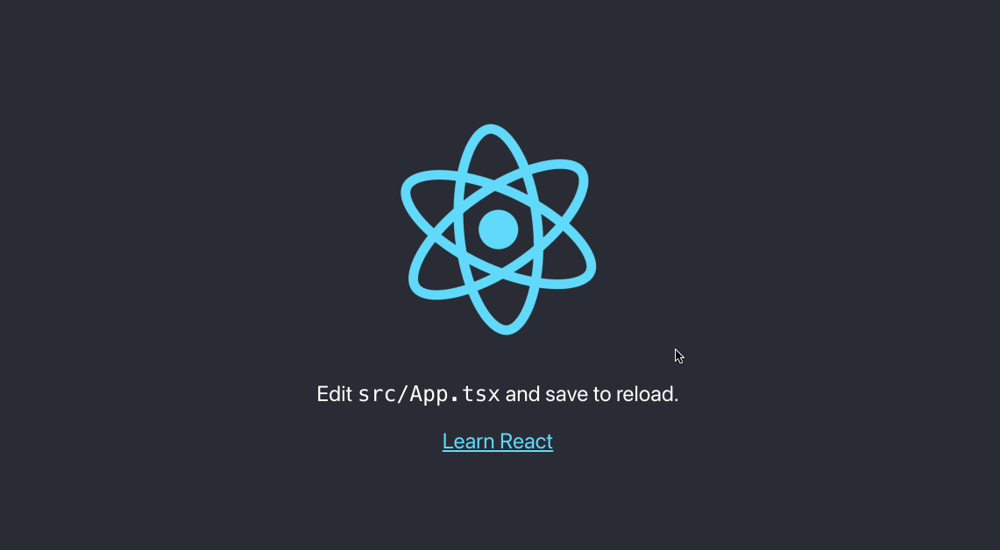
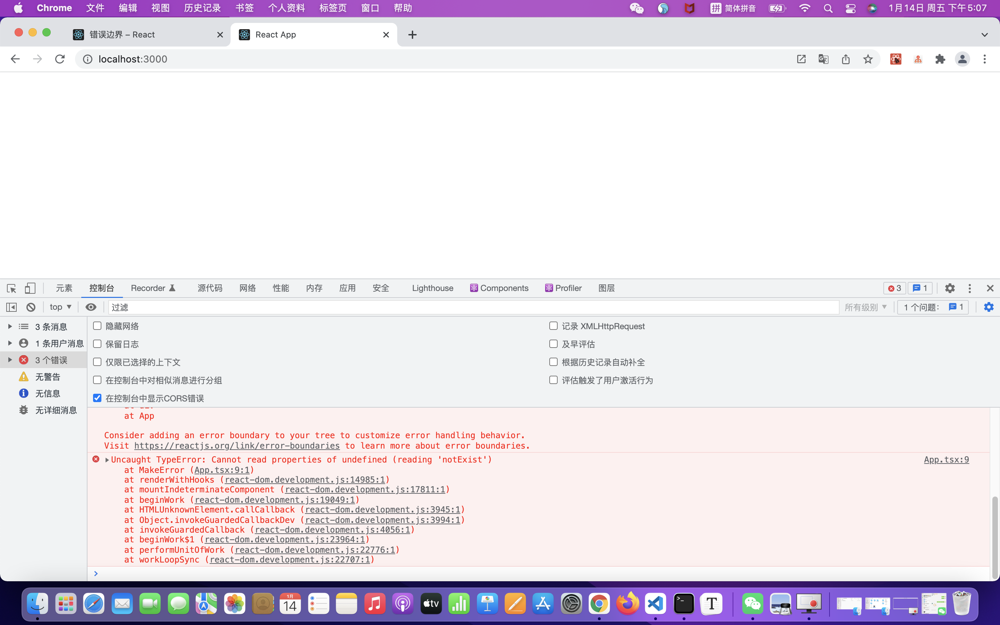
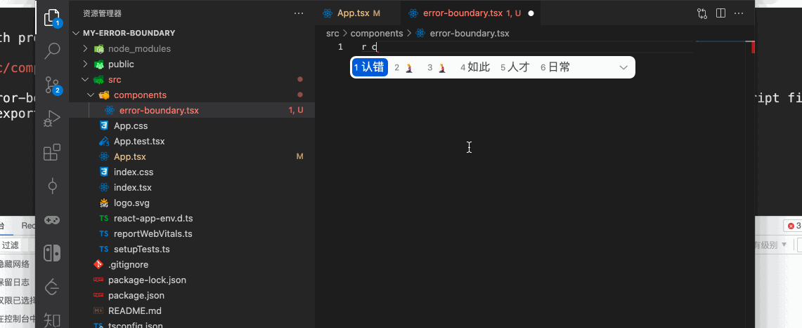
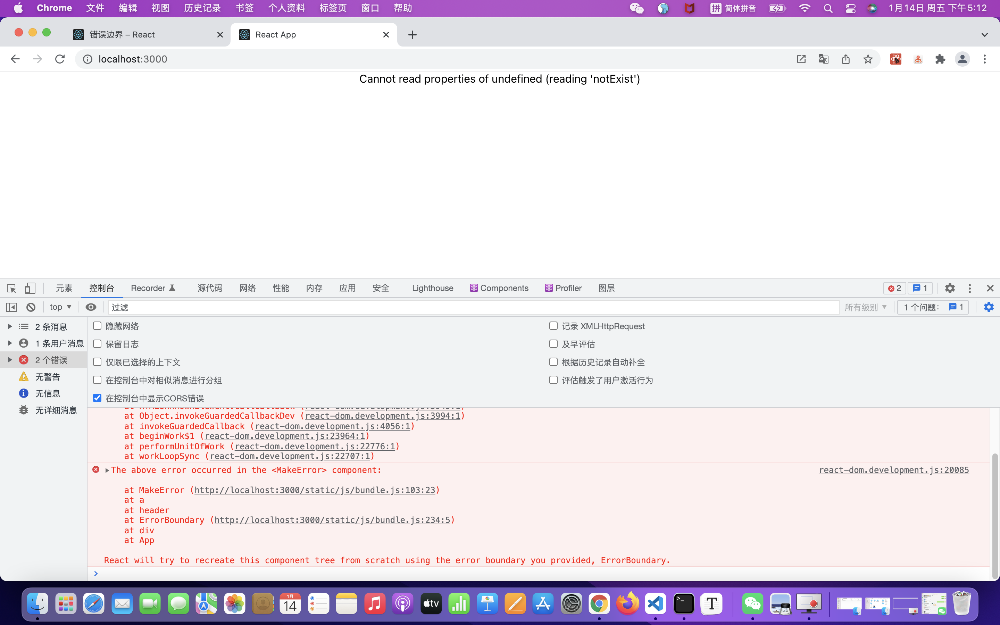
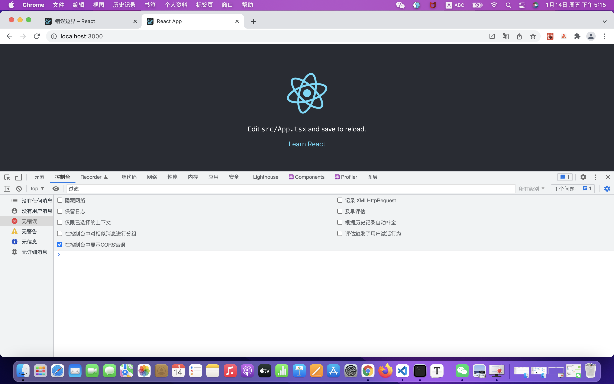

# React错误边界处理

大家好，我是梅利奥猪猪。今天和大家分享的主题是React错误边界处理，不知道大家有没有处理过React的错误边界？如果没有处理过，那就看我这篇文章，保姆级别手摸手指导！

## 案例

我们先写一个案例，用cra直接搭一个react项目！等依赖全部装完后`yarn start`启动下



非常完美，那错误边界又是什么，会发生什么事情，很简单，我们来写`anyscript`，然后写错误的代码看下会怎么样，代码如下

```tsx
import React from 'react';
import logo from './logo.svg';
import './App.css';

const MakeError = () => {
  const value: any = undefined; // 这行是新增的，any类型，赋值undefined
  return (
    // 我们对个undefined做了”.“操作，必然是会报错的
    <span>{value.notExist}</span>
  )
}

function App() {
  
  return (
    <div className="App">
        <header className="App-header">
          
          <p>
            Edit <code>src/App.tsx</code> and save to reload.
          </p>
          <a
            className="App-link"
            href="https://reactjs.org"
            target="_blank"
            rel="noopener noreferrer"
          >
            Learn React 
            <MakeError/>
          </a>
        </header>
    </div>
  );
}

export default App;
```

然后此刻看下页面，看它会怎么发脾气



只见页面直接给你翻了个白眼，不带眼珠的这种（白屏模式），并且控制台给予了清晰的提示`Cannot read properties of undefined (reading 'notExist')`，这是显然的，这个错误不就是我们自己写的嘛（滑稽脸）

在实际工作中，或多或少可能就有这种出现错误直接白屏的情况，那我们应该怎么处理呢

## [错误边界 - React](https://zh-hans.reactjs.org/docs/error-boundaries.html#gatsby-focus-wrapper)

### 白屏现象的原因

以下引用来自官方文档**错误边界**，复制黏贴白话解释组成了这篇水文（开心脸）

> 自 React 16 起，任何未被错误边界捕获的错误将会导致整个 React 组件树被卸载。

> 我们对这一决定有过一些争论，但根据我们的经验，把一个错误的 UI 留在那比完全移除它要更糟糕。例如，在类似 Messenger 的产品中，把一个异常的 UI 展示给用户可能会导致用户将信息错发给别人。同样，对于支付类应用而言，显示错误的金额也比不呈现任何内容更糟糕。

> 此变化意味着当你迁移到 React 16 时，你可能会发现一些已存在你应用中但未曾注意到的崩溃。增加错误边界能够让你在应用发生异常时提供更好的用户体验。

简单的说，就是我们没处理错误，React就不开心，它就把组件树全部卸载，给你看不带眼珠的翻白眼，因为他们觉得错误的ui留在那比翻白眼更可怕！

所以要进入如何处理错误边界的关键环节了

### 错误边界概念

以下引用来自官方文档**错误边界**，复制黏贴白话解释组成了这篇水文（开心脸）

> 部分 UI 的 JavaScript 错误不应该导致整个应用崩溃，为了解决这个问题，React 16 引入了一个新的概念 —— 错误边界。

> 错误边界是一种 React 组件，这种组件可以捕获发生在其子组件树任何位置的 JavaScript 错误，并打印这些错误，同时展示降级 UI，而并不会渲染那些发生崩溃的子组件树。错误边界在渲染期间、生命周期方法和整个组件树的构造函数中捕获错误。

注意看，关键字是`打印错误`和`同时展示降级 UI`

> 如果一个 class 组件中定义了 static getDerivedStateFromError() 或 componentDidCatch() 这两个生命周期方法中的任意一个（或两个）时，那么它就变成一个错误边界。当抛出错误后，请使用 static getDerivedStateFromError() 渲染备用 UI ，使用 componentDidCatch() 打印错误信息。

注意看，只有class组件才可以，还要定义特殊的生命周期方法，官方文档后面有贴代码，当然这里我不会完全复制，会结合ts写一个简单的错误边界组件

```tsx
<ErrorBoundary>
  <MyWidget />
</ErrorBoundary>
```

上述代码也来自官方文档，简单的使用，**Talk is cheap. Show me the code.**，从代码上看，非常直观，如果没有错误，那我就展示`MyWidget`，有错误就展示降级UI并有打印的错误信息，接下来我们就实现个最简单的错误边界组件，拯救没有眼珠的翻白眼吧

### 实现错误边界

#### 第一步

新建`components`文件夹，新建文件`error-boundary.tsx`，然后搭个类组件的架子（如果安装了vscode插件-ES7 React/Redux/GraphQL/React-Native snippets，直接rcc加tab就可以了，ps: rcc意思是react class component）



别问我为什么不写函数组件，因为文档里也说了，错误边界必须用类组件

#### 第二步

结合我们的ts，众所周知，我们Component的泛型是`class Component<P, S>`(不知道的小伙伴，可以鼠标点Component进去看)，所以第一项指的就是我们的**props**，第二项指的就是我们的**state**

接下去我们就要考虑props要传什么，很简单，我们不是正常没有错误的时候展示children就可以了，错误的时候展示降级UI（显示错误的组件），然后我们的state只要记录error就可以了，先show大家code

```tsx
import { Component, ReactElement, PropsWithChildren } from 'react'

// 错误时降级显示的UI组件，props就传个error就可以了，返回就是我们的jsx
type FallbackRender = (props: { error: Error | null }) => ReactElement

export default class ErrorBoundary extends Component<PropsWithChildren<{ fallbackRender: FallbackRender }>, { error: Error | null }> {
    state = {
        error: null, // 默认值 没有错误
    }
    render() {
        return (
            <div>

            </div>
        )
    }
}

```

这里需要解释的估计就是`PropsWithChildren`，我之前写过[Utility Types系列水文](https://juejin.cn/column/7022840715558420487)，`PropsWithChildren`其实就是**Utility Type**，我们看下他是怎么实现的

```ts
type PropsWithChildren<P> = P & { children?: ReactNode | undefined };
```

交叉类型，ts萌新可以简单理解，就相当于是`Object.assign`的操作，把你写的props和children合在了一起，前面也说了，我们的props，就只需要正确时渲染children，触发错误边界的时候渲染降级UI，用了这个`PropsWithChildren`会比较装逼!

#### 第三步

实现静态方法`static getDerivedStateFromError()`，这里就复制官方的代码改造下即可，第三步之后的代码如下

```tsx
import { Component, ReactElement, PropsWithChildren } from 'react'

// 错误时降级显示的UI组件，props就传个error就可以了，返回就是我们的jsx
type FallbackRender = (props: { error: Error | null }) => ReactElement

export default class ErrorBoundary extends Component<PropsWithChildren<{ fallbackRender: FallbackRender }>, { error: Error | null }> {
    state = {
        error: null, // 默认值 没有错误
    }

    static getDerivedStateFromError(error: Error) {
        return { error };
    }

    render() {
        return (
            <div>

            </div>
        )
    }
}
```

#### 第四步

到了封装这个组件的最后步了，处理render的逻辑

* 没有error正常渲染children
* 有error渲染降级UI
最终代码如下

```tsx
import { Component, ReactElement, PropsWithChildren } from 'react'

// 错误时降级显示的UI组件，props就传个error就可以了，返回就是我们的jsx
type FallbackRender = (props: { error: Error | null }) => ReactElement

export default class ErrorBoundary extends Component<PropsWithChildren<{ fallbackRender: FallbackRender }>, { error: Error | null }> {
    state = {
        error: null, // 默认值 没有错误
    }

    static getDerivedStateFromError(error: Error) {
        return { error };
    }

    render() {
        const { error } = this.state
        const { children, fallbackRender } = this.props
        return error ? fallbackRender({ error }) : children
    }
}

```

#### 第五步

那我们可以试下这个新写的组件啦，来到我们的`App.tsx`，撸码撸起

```tsx
import React from 'react';
import logo from './logo.svg';
import './App.css';
import ErrorBoundary from './components/error-boundary';

const ErrorInfo = ({ error }: { error: Error | null }) => (
  <div>
    {error?.message}
  </div>
)

const MakeError = () => {
  const value: any = undefined; // 这行是新增的，any类型，赋值undefined
  return (
    // 我们对个undefined做了”.“操作，必然是会报错的
    <span>{value.notExist}</span>
  )
}

function App() {

  return (
    <div className="App">
      <ErrorBoundary fallbackRender={ErrorInfo}>
        <header className="App-header">
          
          <p>
            Edit <code>src/App.tsx</code> and save to reload.
          </p>
          <a
            className="App-link"
            href="https://reactjs.org"
            target="_blank"
            rel="noopener noreferrer"
          >
            Learn React
            <MakeError />
          </a>
        </header>
      </ErrorBoundary>
    </div>
  );
}

export default App;
```

此时在来看下页面，看下降级的UI是否渲染了



漂亮！非常成功，这个比没有眼珠的翻白眼好多了，至少用户知道有什么错误了！先不要急，我们还要试下没有错误的时候能不能正确渲染，我们把`MakeError`组件干掉在试试看

```tsx
import React from 'react';
import logo from './logo.svg';
import './App.css';
import ErrorBoundary from './components/error-boundary';

const ErrorInfo = ({ error }: { error: Error | null }) => (
  <div>
    {error?.message}
  </div>
)

const MakeError = () => {
  const value: any = undefined; // 这行是新增的，any类型，赋值undefined
  return (
    // 我们对个undefined做了”.“操作，必然是会报错的
    <span>{value.notExist}</span>
  )
}

function App() {

  return (
    <div className="App">
      <ErrorBoundary fallbackRender={ErrorInfo}>
        <header className="App-header">
          
          <p>
            Edit <code>src/App.tsx</code> and save to reload.
          </p>
          <a
            className="App-link"
            href="https://reactjs.org"
            target="_blank"
            rel="noopener noreferrer"
          >
            Learn React
            {/* MakeError用来调试错误边界是否work */}
            {/* <MakeError /> */}
          </a>
        </header>
      </ErrorBoundary>
    </div>
  );
}

export default App;
```



大功告成，这样我们简单处理错误边界就搞定了

## 第三方插件

之前也说了，这篇文章只是带大家实现个基础的简单的错误边界。但这种这么基础的功能，怎么可能没有大佬造过轮子呢，请看[react-error-boundary](https://github.com/bvaughn/react-error-boundary)！这边教大家迅速看源码的小技巧，任何github的仓库，只要你在链接github.com中间加一个1s，比如[https://github1s.com/bvaughn/react-error-boundary](https://github1s.com/bvaughn/react-error-boundary)，就能用编辑器模式直接看源码。基础的思路是和我们差不多的，这边就不展开了，给大家一起学习的机会！

## 总结

今天的水文又写完了，总结就是，多看文档，是不是一下子就学会了新的知识！这里是梅利奥猪猪，希望能帮助到大家！

## 参考

* [错误边界 - React](https://zh-hans.reactjs.org/docs/error-boundaries.html#gatsby-focus-wrapper)
* [react-error-boundary](https://github.com/bvaughn/react-error-boundary)
