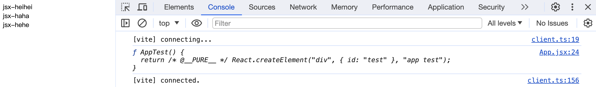

# mini-react之在页面中呈现app

## 实现mini-react

### v0.1

写死dom

```js
const dom = document.createElement('div')
dom.id = 'app'
document.querySelector("#root").append(dom)

const textNode = document.createTextNode('')
textNode.nodeValue = 'app'
dom.append(textNode)
```

### v0.2

基于虚拟dom(js对象)

对象有type，props(包含属性，children)

```js
const el = {
    type: 'div',
    props: {
        id: 'app',
        children: [
            {
                type: 'TEXT_ELEMENT', // 文本节点比较特殊
                props: {
                    nodeValue: 'app',
                    children: []
                }
            }
        ]
    }
}
```
把textEl单独抽离

```js
const textEl = {
    type: 'TEXT_ELEMENT',
    props: {
        nodeValue: 'app',
        children: []
    }
}
const el = {
    type: 'div',
    props: {
        id: 'app',
        children: [
            textEl
        ]
    }
}
```
在根据前面的方式渲染

```js
const dom = document.createElement(el.type)
dom.id = el.props.id
document.querySelector("#root").append(dom)

const textNode = document.createTextNode('')
textNode.nodeValue = textEl.props.nodeValue
dom.append(textNode)
```

但前面的方式还是写死的，能否动态创建虚拟dom
```diff
- // const textEl = {
- //     type: 'TEXT_ELEMENT',
- //     props: {
- //         nodeValue: 'app',
- //         children: []
- //     }
- // }

+ function createTextNode(nodeValue) {
+     return {
+         type: 'TEXT_ELEMENT',
+         props: {
+             nodeValue,
+             children: []
+         }
+     }
+ }

- // const el = {
- //     type: 'div',
- //     props: {
- //         id: 'app',
- //         children: [
- //             textEl
- //         ]
- //     }
- // }


+ function createElement(type, props, ...children) {
+     return {
+         type,
+         props: {
+             ...props,
+             children
+         }
+     }
+ }

+ const textEl = createTextNode('app')
+ const App = createElement('div', { id: 'app' }, textEl)

const dom = document.createElement(App.type)
dom.id = App.props.id
document.querySelector("#root").append(dom)

const textNode = document.createTextNode('')
textNode.nodeValue = textEl.props.nodeValue
dom.append(textNode)
```

接下去就是要动态的创建dom结构，这里就要实现render函数了，分析下来都要实现这么几步
- 创建节点（要区分是文本节点还是元素节点）
- 设置节点属性（遍历设置属性，children属性要单独处理，因为是节点属性）
- 处理children
- 添加节点（给父节点添加）

```diff
- // const dom = document.createElement(App.type)
- // dom.id = App.props.id
- // document.querySelector("#root").append(dom)

- // const textNode = document.createTextNode('')
- // textNode.nodeValue = textEl.props.nodeValue
- // dom.append(textNode)

+ // el是虚拟dom container是父容器
+ function render (el, container) {
+     // 1. 创建节点
+     // 2. 设置非children的属性
+     // 3. 处理children
+     // 4. 添加节点
+     const dom = el.type === 'TEXT_ELEMENT' ? document.createTextNode("") : document.createElement(el.type)
+     Object.keys(el.props).forEach(key => {
+         if (key !== 'children') {
+            dom[key] = el.props[key]
+         }
+     })
+     const children = el.props.children
+     children.forEach(child => {
+         // 递归处理
+         render(child, dom)
+     })
+     container.append(dom)
+ }

+ render(App, document.querySelector('#root'))
```

还有个地方可以优化下，文本节点就传字符串行不行
```diff
- // const textEl = createTextNode('app')
- // const App = createElement('div', { id: 'app' }, textEl)

+ const App = createElement('div', { id: 'app' }, 'app')
```
显然现在是会报错的，我们要对children数组进行处理，是字符串的话手动创建文本节点
```js
function createElement(type, props, ...children) {
    return {
        type,
        props: {
            ...props,
            children: children.map(child => typeof child === 'string' ? createTextNode(child) : child)
        }
    }
}
```

### v0.3

0.3的版本我们要模仿官方react的一些api实现，官方的长这样
```jsx
import React from 'react'
import ReactDOM from 'react-dom/client'
import App from './App.jsx'
import './index.css'

ReactDOM.createRoot(document.getElementById('root')).render(
  <React.StrictMode>
    <App />
  </React.StrictMode>,
)
```
罩着他的样子画瓢
```js
// render(App, document.querySelector('#root'))

const ReactDom = {
    createRoot(container) {
        return {
            render (App) {
                render(App, container)
            }
        }
    }
}
ReactDom.createRoot(document.querySelector('#root')).render(App)
```

### 重构react api

重构代码，拆分下目录

`React.js`，需要返回`render`和`createElement`，`createTextNode`实际使用`React`的时候用不到

```js
// React.js
function createTextNode(nodeValue) {
    return {
        type: 'TEXT_ELEMENT',
        props: {
            nodeValue,
            children: []
        }
    }
}

function createElement(type, props, ...children) {
    return {
        type,
        props: {
            ...props,
            children: children.map(child => typeof child === 'string' ? createTextNode(child) : child)
        }
    }
}

function render(el, container) {
    // 1. 创建节点
    // 2. 设置非children的属性
    // 3. 处理children，需要递归处理 思考：递归会带来什么问题，如果dom树非常庞大
    // 4. 添加节点
    const dom = el.type === 'TEXT_ELEMENT' ? document.createTextNode("") : document.createElement(el.type)
    Object.keys(el.props).forEach(key => {
        if (key !== 'children') {
            dom[key] = el.props[key]
        }
    })
    const children = el.props.children
    children.forEach(child => {
        // 递归处理
        render(child, dom)
    })
    container.append(dom)
}

const React = {
    createElement,
    render,
}

export default React

```

`ReactDom.js`，注意我们的环境，要用到`React.js`中暴露出来的`render`，导入时不能省略`.js`
```js
// ReactDom.js
import React from './React.js';
const ReactDom = {
    createRoot(container) {
        return {
            render (App) {
                React.render(App, container)
            }
        }
    }
}
export default ReactDom
```

`main.js`，同样导入的时候不要忘记`.js`
```js
// main.js
import ReactDom from './core/ReactDom.js';
import React from './core/React.js';
const App = React.createElement('div', { id: 'app' },
    React.createElement('div', null, 'heihei'),
    React.createElement('div', null, 'haha'),
    React.createElement('div', null, 'hehe')
)

ReactDom.createRoot(document.querySelector('#root')).render(App)
```

还可以继续抽离`App.js`
```js
// App.js
import React from './core/React.js';
const App = React.createElement('div', { id: 'app' },
    React.createElement('div', null, 'heihei'),
    React.createElement('div', null, 'haha'),
    React.createElement('div', null, 'hehe')
)

export default App
```

最后`main.js`就是这个样子
```js
import ReactDom from './core/ReactDom.js';
import App from './App.js';
ReactDom.createRoot(document.querySelector('#root')).render(App)
```

## 使用jsx

使用jsx代替js的语法，使用vite工具

### App.js改成App.jsx

修改文件后缀，`main.js`导入的地方也不要忘记改了，能看到控制台明显报错了，因为浏览器只认识js文件不认识jsx文件，所以要将jsx转换为js，那我们就要借助工具`vite`(`webpack`，`babel`也行，但都2024年XDM懂的都懂)

使用`vite`创建项目`pnpm create vite`，项目名根据自己喜欢，接着选择`Vanilla`，安装依赖也不要忘记了

之后我们清理下文件，把对应的代码放进这个项目
- 删除`counter.js`，用不到
- `index.html`，根元素`id`要改为`root`
- `main.js`代码替换
- 拷贝`App.js`到该项目中
- 核心`core`文件夹拷贝到该项目

启动`pnpm dev`项目就能跑了！完美！

### 修改App.jsx中的代码

```diff
import React from './core/React.js';
- // const App = React.createElement('div', { id: 'app' },
- //     React.createElement('div', null, 'heihei'),
- //     React.createElement('div', null, 'haha'),
- //     React.createElement('div', null, 'hehe')
- // )

+ const App = (
+     <div id="app">
+         <div>jsx-heihei</div>
+         <div>jsx-haha</div>
+         <div>jsx-hehe</div>
+     </div>
+ )

console.log(App)
export default App
```

打印出来的`App`也是我们熟悉的那个对象，接着我们在换个函数式组件测试下

```jsx
function AppTest () {
    return (
        <div id="test">app test</div>
    )
}
console.log(AppTest);

```



打印出来的`React.createElement`就是我们实现的，不信可以在方法中打印信息，这里就不做演示了

补充：如果我们想使用自定义的React，该怎么办，比如想用`SfReact.createSfElement`？这里就要用到`js pragma`的应用，找到`App.jsx`文件，在文件开头第一行添加如下注释
```jsx
/** @jsx SfReact.createSfElement */
```
这样我们控制台就能看到`SfReact is not defined`的报错了，因为我们的实现的名字就是`React`

### main.js改为main.jsx

将`main.js`后缀改为`main.jsx`，入口`index.html`引入也改为`main.jsx`，此时发现项目也没有任何问题

接下去修改`main.jsx`中的代码，使用`App`组件的方式
```diff
import ReactDom from './core/ReactDom.js';
import App from './App.jsx';
- ReactDom.createRoot(document.querySelector('#root')).render(App)
+ ReactDom.createRoot(document.querySelector('#root')).render(<App/>)
```

此时报错了找不到`React`，因为我们知道，使用这种方式要调用`React.createElement`，所以我们要在`main.jsx`中导入`React`
```diff
+ import React from './core/React.js';
import ReactDom from './core/ReactDom.js';
import App from './App.jsx';
ReactDom.createRoot(document.querySelector('#root')).render(<App/>)

```

此时报了另外个错，说`tagName`是个对象，的确我们的`App`就是个虚拟`dom`，即使我们改成函数式组件的写法也是没用的，因为我们还没有实现函数式组件，现在就现在`render`中传入`App`对象即可


## 使用vitest做单元测试