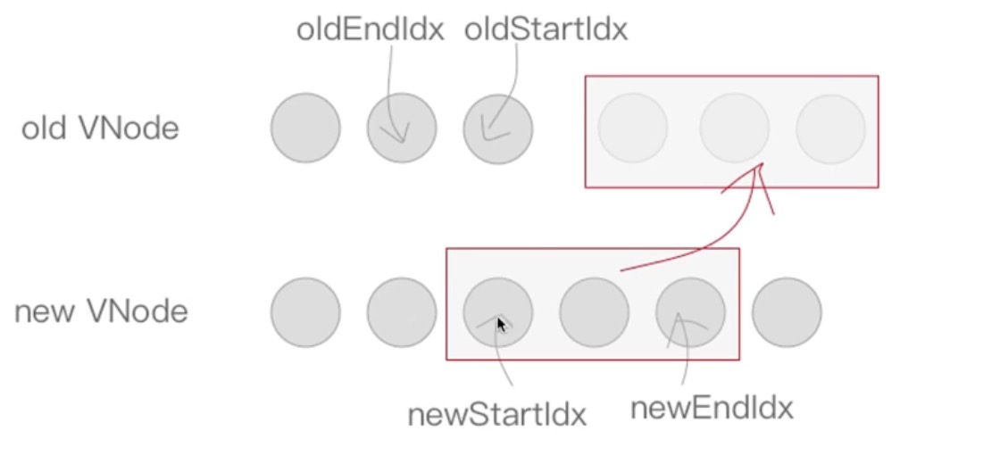

# vue2源码解读

- 环境搭建
- 掌握源码学习方式
- vue初始化过程剖析
- 深入理解数据响应式
- 理解Vue批量异步更新策略
- 掌握虚拟Dom和Diff算法
- 组件化原理

## 环境搭建

- vue2源码(clone后切换版本2.6.14版本)
- 创建学习的分支`git checkout -b vue2-study-xxx`
- 目录结构说明
  - dist (发布目录)
  - examples (范例)
  - flow (flow的类型声明)
  - packages (核心代码之外的独立库)
  - scripts (构建脚本)
  - src (源码)
    - compile (编译器)
    - core (核心代码 - 经常看)
      - components (通用组件如keep-alive)
      - global-api (全局api如set，delete，nextTick)
      - instance (构造函数等)
      - observer (响应式相关)
      - util
      - vdom (虚拟dom相关)
    - platforms (平台)
    - server (服务端渲染)
    - sfc (单文件组件)
    - shared
  - test (测试代码)
  - types (ts类型声明)
- 安装依赖
  - `npm i`
  - `npm i -g rollup`
  - dev脚本添加 `--sourcemap` (目的是可以和源码一一对应)
  - npm run dev(dist目录生成vue.js)
- 准备实例代码
  - examples里新建test文件夹
  - 初始化代码准备(新建`01-初始化.html`)

    ```html
    <!DOCTYPE html>

    <html lang="en">

    <head>
        <meta charset="UTF-8">
        <meta name="viewport" content="width=device-width, initial-scale=1.0">
        <title>初始化流程</title>
    </head>

    <body>
        <div id="app">
            <div>
                <h1>初始化流程</h1>
                <h2>{{ foo }}</h2>
            </div>
        </div>
        <script src="../../dist/vue.js"></script>
        <script>
            const vm = new Vue({
                el: '#app',
                // template: '<div>template</div>',
                // template: '#app',
                // render(h) {
                //     return h('div', 'render')
                // },
                data: {
                    foo: 'foo'
                }
            })
            console.log(vm.$options.render);
        </script>
    </body>

    </html>
    ```

  - 断点打在`new Vue`这行
  - 进入方法，右键`Reveal in siderbar`
  - 能找到对应构造函数的位置
  - 小提问，会看options吗

- 术语解释(打包后生成的文件)
  - runtime: 仅包含运行时，不包含编译器 (vue-cli用的就是runtime, 打包阶段vue-loader已经做了编译，就不需要编译器了)
  - common: cjs规范，用于webpack1 (vue可能在ssr跑，服务端)
  - esm: ES模块，用于webpack2+
  - umd: universal module definition，兼容cjs和amd (前面的dist打包出来的vuejs就是umd版本)

## 掌握源码学习方式

### 找入口文件

#### 起手先看package.json

看脚本dev`"dev": "rollup -w -c scripts/config.js --sourcemap --environment TARGET:web-full-dev",`

那接下去就要去看`scripts/config.js`

#### 通过config.js找到真相

根据前面的环境，找到`web-full-dev`

```js
  // Runtime+compiler development build (Browser)
  'web-full-dev': {
    // entry 入口
    entry: resolve('web/entry-runtime-with-compiler.js'),
    dest: resolve('dist/vue.js'),
    format: 'umd',
    env: 'development',
    alias: { he: './entity-decoder' },
    banner
  },
```

在看`resolve`方法

```js
const aliases = require('./alias')
const resolve = p => {
  // 这里的base指的是web
  const base = p.split('/')[0]
  // 要看别名web是哪个路径
  if (aliases[base]) {
    return path.resolve(aliases[base], p.slice(base.length + 1))
  } else {
    return path.resolve(__dirname, '../', p)
  }
}
```

接着去找下`./alias`

```js
{
  web: resolve('src/platforms/web'),
}
```

那最终我们要找的路径就应该是`src/platforms/web/entry-runtime-with-compiler.js`

于是入口文件就get了！

### 找Vue构造函数

#### entry-runtime-with-compiler.js

- 入口
- 扩展`$mount`方法
  - 没有`render`函数则处理逻辑
  - 配置的优先级顺序，`render > template > el`
  - `template` => `render`
  - `render`函数会被放在options
  - 执行默认的挂载方法`mount`
  - 我们写的测试代码，没有执行$mount也能挂载的原因之后再揭晓

#### src/platforms/web/runtime/index.js  

- 安装补丁函数(`patch`)，将虚拟dom最终转成真实dom
- 实现`$mount`，调用`mountComponent`
  - 虚拟dom => 真实dom => 挂载(append)

#### src/core/index.js

- `initGlobalAPI(Vue)` 初始化全局的Api，set/delete/nextTick等等

#### src/core/instance/index.js

此时就找到了构造函数，看到了里面就做了一件事，那就是初始化

```js
function Vue (options) {
  // 打印输出的的代码可以忽略就看重点
  ...
  this._init(options)
}
```

那这个`_init`是怎么来的呢

初始化实例方法和属性

```js
initMixin(Vue) // 在这个方法实现里，能看到实例上添加了_init方法
stateMixin(Vue)
eventsMixin(Vue)
lifecycleMixin(Vue)
renderMixin(Vue)
```

## vue初始化过程剖析(面试题之new Vue做了什么事情)

### src/core/instance/init.js

- 选项合并，用户的选项和系统的选项要合并，比如为什么我们能使用keep-alive,transition组件呢

```js
    // merge options
    if (options && options._isComponent) {
      // optimize internal component instantiation
      // since dynamic options merging is pretty slow, and none of the
      // internal component options needs special treatment.
      initInternalComponent(vm, options)
    } else {
      vm.$options = mergeOptions(
        resolveConstructorOptions(vm.constructor),
        options || {},
        vm
      )
    }
```

- 初始化

```js
initLifecycle(vm) // 出生证明，baby出生的一些属性
initEvents(vm) // 初始化事件 如<test-comp @my-click="handleClick" />
initRender(vm) // 处理插槽及$createElement(render函数的h)
callHook(vm, 'beforeCreate')
initInjections(vm) // resolve injections before data/props
initState(vm) // props methods data computed watch
initProvide(vm) // resolve provide after data/props
callHook(vm, 'created')
```

- 判断是el选项就挂载

```js
if (vm.$options.el) {
  vm.$mount(vm.$options.el)
}
```

### 初始化后就要挂载了-src/platforms/web/runtime/index.js

#### mountComponent

看`$mount`的实现，主要看实现方法`mountComponent`

- 组件更新函数的声明`let updateComponent`
  - 先执行`render`函数拿到`vdom`，再执行`update`函数
  - `_update`函数就在该文件里可以找到，
  - 初始化时没有上次的`vdom`，走`if`，之后所有的更新走`else`（diff算法在else发生）

    ```js
    if (!prevVnode) {
      // initial render
      vm.$el = vm.__patch__(vm.$el, vnode, hydrating, false /* removeOnly */)
    } else {
      // updates
      vm.$el = vm.__patch__(prevVnode, vnode)
    }
    ```

#### 核心代码还有组件Watcher实例化

一个组件一个Watcher

```js
// 第二个参数传入updateComponent，会立即执行一次
  new Watcher(vm, updateComponent, noop, {
    before () {
      if (vm._isMounted && !vm._isDestroyed) {
        callHook(vm, 'beforeUpdate')
      }
    }
  }, true /* isRenderWatcher */)
```

### 代码调试学习初始化流程

打断点一个一个看！

## 深入理解数据响应式

### initState

props，methods和data起一样的名字会怎么样？有优先级

```js
  // 优先级顺序
  if (opts.props) initProps(vm, opts.props)
  if (opts.methods) initMethods(vm, opts.methods)
  if (opts.data) {
    initData(vm)
  }
```

### initData

重点看initData

- 判断是函数还是对象，函数则要执行
- 判断methods和props是否有重名的
- observe做响应式

### observe方法

```js
export function observe (value: any, asRootData: ?boolean): Observer | void {
  if (!isObject(value) || value instanceof VNode) {
    return
  }
  let ob: Observer | void
  if (hasOwn(value, '__ob__') && value.__ob__ instanceof Observer) {
    // 如果做过响应式了直接就返回
    ob = value.__ob__
  } else if (
    shouldObserve &&
    !isServerRendering() &&
    (Array.isArray(value) || isPlainObject(value)) &&
    Object.isExtensible(value) &&
    !value._isVue
  ) {
    // 实例化Observe
    ob = new Observer(value)
  }
  if (asRootData && ob) {
    ob.vmCount++
  }
  return ob
}
```

注意看他会返回Observe实例

### Observer类

- 之前的博客有给大家简单分析过区分数组和对象
- 这次要聊下创建了`new Dep()`干什么用的
  - Vue.set/delete在之前的defineProperty它是没法拦截的
  - 那如何去通知他们呢，响应式数据设置删除字段这里的dep负责通知更新
  - 数组方法也是通过这个dep去通知的

- defineReactive

```js
  let childOb = !shallow && observe(val)
  Object.defineProperty(obj, key, {
    enumerable: true,
    configurable: true,
    get: function reactiveGetter () {
      const value = getter ? getter.call(obj) : val
      if (Dep.target) {
        dep.depend()
        if (childOb) {
          childOb.dep.depend()
          if (Array.isArray(value)) {
            dependArray(value)
          }
        }
      }
      return value
    },
    ...
  })
```

之前简易的Vue，一个Dep管理多个Watcher(因为我们依赖很多)，但现在一个组件就一个Watcher，Dep的key可多了，那就变成了多个Dep对一个Watcher的感觉了，但除了组件的watcher外，还有用户的watcher，所以也会有多个watcher，那就变成了多对多的关系

```html
<!DOCTYPE html>
<html lang="en">

<head>
    <meta charset="UTF-8">
    <meta name="viewport" content="width=device-width, initial-scale=1.0">
    <title>响应式依赖分析</title>
</head>

<body>
    <div id="app">
        {{obj.foo}}
    </div>
    <script src="../../dist/vue.js"></script>
    <script>
        // Observer? Dep?  Watcher?
        // 2         4     1       
        const app = new Vue({
            el: '#app',
            data: { // ob + dep
                obj: { // ob + dep
                    foo: 'foo'
                }
            },
            mounted() {
                setTimeout(() => {
                    this.obj.foo = 'bar'
                    // this.$set(this.obj, 'bar', 'bar')
                }, 1000)
            }
        })

    </script>
</body>

</html>
```

- 有几个对象就有几个Observer
- 有几个key就有几个Dep(小管家)
  - 对应key变化更新通知
- 不要忘记每有一个Observer，里面也有一个Dep(大管家)
  - 新增删除属性通知
- 组件Watcher就一个，如果有用户Watcher在追加

## 理解Vue批量异步更新策略

异步更新队列，Vue高效的秘诀是一套**批量**，**异步**的更新策略

底层的机制就是**event loop**


[一个老外写的博客](https://jakearchibald.com/2015/tasks-microtasks-queues-and-schedules/)


- 异步：只要侦听到数据变化，Vue将开启一个队列，并缓冲到同一事件循环中发生的所有数据变更
- 批量：如果同一个watcher被多次触发，只会被推入到队列中一次。去重对于避免不必要的计算和DOM操作是非常重要的。然后，在下一个事件循环tick中，Vue刷新队列执行实际工作
- 异步策略：Vue在内部对异步队列尝试使用原生的`Promise.then`,`MutationObserver`,`setImmediate`，如果执行环境都不支持，则会采用`setTimeout`代替

### 测试demo

```html
<!DOCTYPE html>
<html lang="en">

<head>
    <meta charset="UTF-8">
    <meta name="viewport" content="width=device-width, initial-scale=1.0">
    <title>nextTick</title>
</head>

<body>
    <div id="app">
        <p id="p">{{foo}}</p>
    </div>
    <script src="../../dist/vue.js"></script>
    <script>
        const app = new Vue({
            el: '#app',
            data: {
                foo: 'ready!'
            },
            mounted() {
                this.foo = Math.random()
                console.log('1:' + this.foo);
                this.foo = Math.random()
                console.log('2:' + this.foo);
                this.foo = Math.random()
                console.log('3:' + this.foo);
                console.log('p.innerHTML:' + p.innerHTML);

                this.$nextTick(() => {
                    console.log('p.innerHTML:' + p.innerHTML);
                })
            }
        })
    </script>
</body>

</html>
```

### 从defineReactive的劫持开始找

找到`dep.notify`，在找到watcher的`update`方法

```js
  update () {
    /* istanbul ignore else */
    if (this.lazy) {
      // 做标记, 一般是计算属性
      this.dirty = true
    } else if (this.sync) {
      // watch:{sync: true} 同步执行,立刻执行,一般不会这么写
      this.run()
    } else {
      // 一般情况会走这里的代码，watcher会排队 
      queueWatcher(this)
    }
  }
```

### src/core/observer/scheduler.js

接下去分析下`queueWatcher`这个方法

- 去重，首次能进入队列
- 没在洗，才入队
- 没有等，调用nextTick，异步启动队列冲刷任务
  - nextTick(flushSchedulerQueue)
  - 白话解释：nextTick启动异步任务，在未来的某一个时刻执行flushSchedulerQueue
  - 未来的哪个时刻，取决于平台是否支持微任务

### src/core/util/next-tick.js

nextTick做了什么，是面试高频题

- cb做了一次封装，不是立刻执行，包装成高阶函数，处理异常错误
- 存入callbacks数组中
- 标识符pending，异步任务只会执行一次，timerFunc执行
- timerFunc是什么，根据环境判断，是否支持微任务，优先微任务
- 在看微任务，会执行flushCallbacks，他就是执行callbacks数组里的每一项watcher
  - flushCallbacks异步微任务
  - 最终执行的就是flushSchedulerQueue

### flushSchedulerQueue

- src/core/observer/scheduler.js
- 遍历所有的watcher，执行run函数

### watcher

- run方法中的嵌套在里面的第二个`if`，是`user watcher`才会执行
- `render watcher`组件的watcher

```js
if (this.active) {
  const value = this.get()
}
```

- watcher的get方法
  - `value = this.getter.call(vm, vm)`核心逻辑执行getter函数
  - getter是什么东西

  ```js
    if (typeof expOrFn === 'function') {
      this.getter = expOrFn
    } 
  ```

  - expOrFn是构造函数第二个参数，就是组件更新函数，如果参数2是组件更新函数，则直接赋值给getter

### updateComponent

- 所以组件更新函数会执行
- render拿到虚拟dom
- update(vnode)做更新
- patch(oldVnode, vnode) diff算法

### 测试demo练习及讲解

调试代码

- 调整nextTick的位置
- 添加Promise相关代码

```html
<!DOCTYPE html>
<html lang="en">

<head>
    <meta charset="UTF-8">
    <meta name="viewport" content="width=device-width, initial-scale=1.0">
    <title>nextTick</title>
</head>

<body>
    <div id="app">
        <p id="p">{{foo}}</p>
    </div>
    <script src="../../dist/vue.js"></script>
    <script>
        const app = new Vue({
            el: '#app',
            data: {
                foo: 'ready!'
            },
            mounted() {
                
                this.foo = Math.random()
                console.log('1:' + this.foo);
                this.foo = Math.random()
                console.log('2:' + this.foo);
                this.foo = Math.random()
                console.log('3:' + this.foo);
                console.log('p.innerHTML:' + p.innerHTML);
                // 新增Promise
                Promise.resolve().then(() => {
                    console.log('promise:' + p.innerHTML);
                })
                // 在nextTick前加Promise
                this.$nextTick(() => {
                    console.log('p.innerHTML:' + p.innerHTML);
                })
            }
        })
    </script>
</body>

</html>
```

### nextTick小结

- 是什么？
  - vue**批量**，**异步**更新策略的执行者！组件更新时，不会立刻执行，通过nextTick异步启用

- 为什么要用？
  - 访问dom最新的值

- 怎么用？
  - nextTick(cb)

- 原理？
  - event loop
  - 数据变化，watcher入队，异步冲刷队列

## 掌握虚拟Dom和Diff算法

### 虚拟Dom

#### 概念

虚拟Dom(Virtual DOM) 是对DOM的JS抽象表示，是JS对象，能够描述DOM结构和关系。应用的各种状态变化会作用于虚拟DOM，最终映射到DOM上

#### 更新函数说明

- _update函数，更新函数的if，初始化只执行一次，else才是diff算法
- diff:因为组件只有一个watcher，内部变化可能有多个值，为了知道变化点，所以要做2次vnode的变化点，从而得到不同点，进行差异化更新，不同点转化为dom操作


直接操作DOM是高效的，那为什么说虚拟DOM更高效呢

比如一个列表数据5条数据，没隔5s数据会更新，如果自己做的话可能想的技术方案是这样的

- 开个定时器，没隔5s执行逻辑
- 删除所有列表项
- 在重新添加

但有虚拟dom，li是可以复用的，直接修改li的数据即可，甚至有一样类似的数据，标记ID是不是就更高效了

#### 优点

- 虚拟DOM轻量，快速，当他们发生变化时通过新旧虚拟DOM对比可以得到最小DOM操作量，配合一步更新策略减少刷新频率，从而提升性能

- 跨平台，将虚拟DOM更新转化为不同运行时特殊操作实现跨平台

- 兼容性，还可以加入兼容性代码增强操作的兼容性

#### snabbdom

- init方法执行返回patch函数
- patch接受2个参数
  - 元素+虚拟dom 初始化
  - 老虚拟dom+新的虚拟dom 将旧节点更新为新节点

#### 源码__patch__  

- `src/platforms/web/runtime/index.js`
- `src/platforms/web/runtime/patch.js`
- `src/core/vdom/patch.js`
  - `export const patch: Function = createPatchFunction({ nodeOps, modules })`
  - 工厂函数，传入平台特有的节点操作和属性操作，生成一个平台专有的patch

#### createPatchFunction

- sameVnode
- sameInputType
- createKeyToOldIdx
- createPatchFunction
  - 最终return了patch函数

### Diff算法

#### 树级别比较

- 首先进行树级别比较 存在情况增删改（为什么只有一个根节点因为patch处理首先就是根据树根开始）
  - newVnode不存在就删

  ```js
    if (isUndef(vnode)) {
      if (isDef(oldVnode)) invokeDestroyHook(oldVnode)
      return
    }
  ```

  - oldVnode不存在就新增

  ```js
    if (isUndef(oldVnode)) {
      // empty mount (likely as component), create new root element
      isInitialPatch = true
      createElm(vnode, insertedVnodeQueue)
    } else {
      // 平时框架走这个else
    } 
  ```

  - 都存在diff更新

  ```js
    const isRealElement = isDef(oldVnode.nodeType)
    if (!isRealElement && sameVnode(oldVnode, vnode)) {
      // patch existing root node
      patchVnode(oldVnode, vnode, insertedVnodeQueue, null, null, removeOnly)
    } else {
      // 初始化
    }
  ```


#### 测试页面

```html
<!DOCTYPE html>
<html lang="en">

<head>
    <meta charset="UTF-8">
    <meta name="viewport" content="width=device-width, initial-scale=1.0">
    <title>vdom</title>
</head>

<body>
    <div id="app">
        <h1>vdom</h1>
        <p>{{ foo }}</p>
    </div>
    <script src="../../dist/vue.js"></script>
    <script>
        const app = new Vue({
            el: '#app',
            data: {
                foo: 'foo'
            },
            mounted() {
                setTimeout(() => {
                    this.foo = 'bar'
                }, 2000)
            }
        })
    </script>
</body>

</html>
```

可以断点调试

#### patchVnode

比较两个VNode，包括三种类型操作：属性更新，文本更新，子节点更新

具体规则如下

1. 新老节点均有children子节点，则对子节点进行diff操作，调用updateChildren
2. 如果新节点有子节点而老节点没有，先清空老节点的文本内容然后为其新增子节点
3. 当新节点没有子节点而老节点有子节点，则移除该节点的所有子节点
4. 当新老节点都无子节点的时候，只是文本的替换

```js
// 获取双方的孩子
const oldCh = oldVnode.children
const ch = vnode.children

if (isDef(data) && isPatchable(vnode)) {
  // 更新属性
  for (i = 0; i < cbs.update.length; ++i) cbs.update[i](oldVnode, vnode)
  if (isDef(i = data.hook) && isDef(i = i.update)) i(oldVnode, vnode)
}
if (isUndef(vnode.text)) {
  // 新节点没有文本
  if (isDef(oldCh) && isDef(ch)) {
    // 都有孩子，比较孩子们
    if (oldCh !== ch) updateChildren(elm, oldCh, ch, insertedVnodeQueue, removeOnly)
  } else if (isDef(ch)) {
    // 新的有孩子，老的没有孩子 添加操作
    if (process.env.NODE_ENV !== 'production') {
      checkDuplicateKeys(ch)
    }
    if (isDef(oldVnode.text)) nodeOps.setTextContent(elm, '')
    addVnodes(elm, null, ch, 0, ch.length - 1, insertedVnodeQueue)
  } else if (isDef(oldCh)) {
    // 新的有孩子 老的没孩子 删除操作
    removeVnodes(oldCh, 0, oldCh.length - 1)
  } else if (isDef(oldVnode.text)) {
    // 新的老的都没孩子，老的有文本，新的就清空文本
    nodeOps.setTextContent(elm, '')
  }
} else if (oldVnode.text !== vnode.text) {
  // 新节点有文本，老的节点和新的节点文本内容不一样
  nodeOps.setTextContent(elm, vnode.text)
}
```

#### updateChildren


updateChildren主要作用是一种较高效的方式比对新旧两个Vnode的chldren得出最小操作补丁。执行一个双循环是传统方式，Vue中针对web场景特点做了特别的算法优化

在新老两组Vnode节点的左右头尾两侧都有一个变量标记，在遍历过程中这几个变量都会向中间靠拢。当**oldStartIdx > oldEndIdx**或者**newStartIdx > newEndIdx**时结束循环





```js
  function updateChildren (parentElm, oldCh, newCh, insertedVnodeQueue, removeOnly) {
    let oldStartIdx = 0
    let newStartIdx = 0
    let oldEndIdx = oldCh.length - 1
    let oldStartVnode = oldCh[0]
    let oldEndVnode = oldCh[oldEndIdx]
    let newEndIdx = newCh.length - 1
    let newStartVnode = newCh[0]
    let newEndVnode = newCh[newEndIdx]
    let oldKeyToIdx, idxInOld, vnodeToMove, refElm

    // removeOnly is a special flag used only by <transition-group>
    // to ensure removed elements stay in correct relative positions
    // during leaving transitions
    const canMove = !removeOnly

    if (process.env.NODE_ENV !== 'production') {
      checkDuplicateKeys(newCh)
    }

    while (oldStartIdx <= oldEndIdx && newStartIdx <= newEndIdx) {
      if (isUndef(oldStartVnode)) {
        // 做校正 索引和vnode对应
        oldStartVnode = oldCh[++oldStartIdx] // Vnode has been moved left
      } else if (isUndef(oldEndVnode)) {
        // 做校正 索引和vnode对应
        oldEndVnode = oldCh[--oldEndIdx]
      } else if (sameVnode(oldStartVnode, newStartVnode)) {
        // 老头和新头一样
        patchVnode(oldStartVnode, newStartVnode, insertedVnodeQueue, newCh, newStartIdx)
        oldStartVnode = oldCh[++oldStartIdx]
        newStartVnode = newCh[++newStartIdx]
      } else if (sameVnode(oldEndVnode, newEndVnode)) {
        // 老尾和新尾一样
        patchVnode(oldEndVnode, newEndVnode, insertedVnodeQueue, newCh, newEndIdx)
        oldEndVnode = oldCh[--oldEndIdx]
        newEndVnode = newCh[--newEndIdx]
      } else if (sameVnode(oldStartVnode, newEndVnode)) { // Vnode moved right
        // 老头和新尾一样
        patchVnode(oldStartVnode, newEndVnode, insertedVnodeQueue, newCh, newEndIdx)
        canMove && nodeOps.insertBefore(parentElm, oldStartVnode.elm, nodeOps.nextSibling(oldEndVnode.elm))
        oldStartVnode = oldCh[++oldStartIdx]
        newEndVnode = newCh[--newEndIdx]
      } else if (sameVnode(oldEndVnode, newStartVnode)) { // Vnode moved left
        // 老尾和新头一样
        patchVnode(oldEndVnode, newStartVnode, insertedVnodeQueue, newCh, newStartIdx)
        canMove && nodeOps.insertBefore(parentElm, oldEndVnode.elm, oldStartVnode.elm)
        oldEndVnode = oldCh[--oldEndIdx]
        newStartVnode = newCh[++newStartIdx]
      } else {
        // 老老实实找 - 拿出新的第一个去老数组里找
        if (isUndef(oldKeyToIdx)) oldKeyToIdx = createKeyToOldIdx(oldCh, oldStartIdx, oldEndIdx)
        idxInOld = isDef(newStartVnode.key)
          ? oldKeyToIdx[newStartVnode.key]
          : findIdxInOld(newStartVnode, oldCh, oldStartIdx, oldEndIdx)
        if (isUndef(idxInOld)) { // New element
          // 老的里面没找到 新增元素
          createElm(newStartVnode, insertedVnodeQueue, parentElm, oldStartVnode.elm, false, newCh, newStartIdx)
        } else {
          // 老的找到了
          vnodeToMove = oldCh[idxInOld]
          if (sameVnode(vnodeToMove, newStartVnode)) {
            // 是一样的节点 直接patch
            patchVnode(vnodeToMove, newStartVnode, insertedVnodeQueue, newCh, newStartIdx)
            oldCh[idxInOld] = undefined
            canMove && nodeOps.insertBefore(parentElm, vnodeToMove.elm, oldStartVnode.elm)
          } else {
            // same key but different element. treat as new element
            // 不是一样的节点，不一样的元素，直接诶创建元素替换
            createElm(newStartVnode, insertedVnodeQueue, parentElm, oldStartVnode.elm, false, newCh, newStartIdx)
          }
        }
        newStartVnode = newCh[++newStartIdx]
      }
    }
    if (oldStartIdx > oldEndIdx) {
      // 老的先结束，新增
      refElm = isUndef(newCh[newEndIdx + 1]) ? null : newCh[newEndIdx + 1].elm
      addVnodes(parentElm, refElm, newCh, newStartIdx, newEndIdx, insertedVnodeQueue)
    } else if (newStartIdx > newEndIdx) {
      // 新的先结束，移除
      removeVnodes(oldCh, oldStartIdx, oldEndIdx)
    }
  }
```

#### key的作用

看`sameVnode`方法

```js
function sameVnode (a, b) {
  return (
    a.key === b.key &&
    a.asyncFactory === b.asyncFactory && (
      (
        a.tag === b.tag &&
        a.isComment === b.isComment &&
        isDef(a.data) === isDef(b.data) &&
        sameInputType(a, b)
      ) || (
        isTrue(a.isAsyncPlaceholder) &&
        isUndef(b.asyncFactory.error)
      )
    )
  )
}
```

相同节点判断逻辑

- key相同
- tag相同
- input type相同
- 都是comment
- 属性相同
- 异步组件情况

数组更新分析 不加key

`undefined === undefined && tag === tag`, 永远认为是相同节点

- 老的 - [1, 2, 3]
- 新的 - [1, 4, 2, 3]

- 老的 - [2, 3]
- 新的 - [4, 2, 3]

- 老的 - [3]
- 新的 - [2, 3]

- 老的 - []
- 新的 - [3]

一共更新了3次，多更新了2次

数组更新分析 加key

- 老的 - [1, 2, 3]
- 新的 - [1, 4, 2, 3]

- 老的 - [2, 3]
- 新的 - [4, 2, 3]

- 老的 - [2]
- 新的 - [4, 2]

- 老的 - []
- 新的 - [4]

只做了一次更新，尽可能少的做创建和更新

## 组件化原理

### 声明注册

- 全局 Vue.component(name, def)
  - 将def转换为组件的构造函数并注册到组件配置的components选项中
- 局部 components选项
  - 理解和全局注册的内在联系

`src/core/index.js`下`initGlobalAPI`

在找到`src/core/global-api/index.js`

可惜的是`component`,`filter`,`directive`都找不到

因为这3个方法的相似性，放在一个数组里做了遍历，具体可以看`initAssetRegisters`

```ts
/* @flow */

import { ASSET_TYPES } from 'shared/constants'
import { isPlainObject, validateComponentName } from '../util/index'

export function initAssetRegisters (Vue: GlobalAPI) {
  /**
   * Create asset registration methods.
   */
  ASSET_TYPES.forEach(type => {
    Vue[type] = function (
      id: string,
      definition: Function | Object
    ): Function | Object | void {
      if (!definition) {
        return this.options[type + 's'][id]
      } else {
        /* istanbul ignore if */
        if (process.env.NODE_ENV !== 'production' && type === 'component') {
          validateComponentName(id)
        }
        if (type === 'component' && isPlainObject(definition)) {
          definition.name = definition.name || id
          // this.options._base => Vue
          // Vue.extend返回构造函数
          definition = this.options._base.extend(definition)
        }
        if (type === 'directive' && typeof definition === 'function') {
          definition = { bind: definition, update: definition }
        }
        // components[组件id] = 构造函数
        this.options[type + 's'][id] = definition
        return definition
      }
    }
  })
}

```

以上代码就可以发现，全局注册就是在选项的components里放东西

也可以看下extend实现方式，`src/core/global-api/extend.js`

### 组件实例化

只见过根组件实例化，其他组件的实例化发生在什么时候

#### 根组件$mount

在根组件$mount的时候，vdom => dom，递归时发现有自定义组件，自定义组件的vdom长什么样

观察自定义组件渲染函数

准备测试的html

```html
<!DOCTYPE html>
<html lang="en">
<head>
    <meta charset="UTF-8">
    <meta name="viewport" content="width=device-width, initial-scale=1.0">
    <title>自定义组件</title>
</head>
<body>
    <div id="app">
        <h1>Vue组件化机制</h1>
        <comp></comp>
    </div>
    <script src="../../dist/vue.js"></script> 
    <script>
        Vue.component('comp', {
            template: '<div>我是Comp</div>'
        })
        const app = new Vue({
            el: '#app',
        })
        console.log(app.$options.render);
    </script>
</body>
</html>
```

打印出来的结果分析下

```js
ƒ anonymous(
) {
with(this){return _c('div',{attrs:{"id":"app"}},
// 重点看数组
[
  _c('h1',[_v("Vue组件化机制")]),
  _v(" "),
  _c('comp')
]
,1)}
}
```

`_c`,`_v`是什么,自定义组件有什么不一样的地方(不能起平常使用的标签名)

`src/core/instance/render-helpers/index.js` 能找到`_v`的答案

有`v-for`会看到`_l`,有插槽会看到`_t`

#### 根组件render

`render => _update => patch`

会递归，遇到自定义组件后会实例化，所以接下去要找下`_c`

#### 获取组件的构造函数

`src/core/instance/render.js` - initRender方法

```js
  // bind the createElement fn to this instance
  // so that we get proper render context inside it.
  // args order: tag, data, children, normalizationType, alwaysNormalize
  // internal version is used by render functions compiled from templates
  // 内部版本 第六个参数是false 标准化处理，编译器做的肯定标准
  vm._c = (a, b, c, d) => createElement(vm, a, b, c, d, false)
  // normalization is always applied for the public version, used in
  // user-written render functions.
  // 用户使用的 第六个参数是true 用户手写的不一定标准，用户可能传不同个数的参数，2个，3个等等
  vm.$createElement = (a, b, c, d) => createElement(vm, a, b, c, d, true)
```

在去找createElement方法 `src/core/vdom/create-element.js`

找到`_createElement`, 找tag的处理

```js
  if (typeof tag === 'string') {
    let Ctor
    ns = (context.$vnode && context.$vnode.ns) || config.getTagNamespace(tag)
    if (config.isReservedTag(tag)) {
      // platform built-in elements
      if (process.env.NODE_ENV !== 'production' && isDef(data) && isDef(data.nativeOn) && data.tag !== 'component') {
        warn(
          `The .native modifier for v-on is only valid on components but it was used on <${tag}>.`,
          context
        )
      }
      vnode = new VNode(
        config.parsePlatformTagName(tag), data, children,
        undefined, undefined, context
      )
    } else if ((!data || !data.pre) && isDef(Ctor = resolveAsset(context.$options, 'components', tag))) {
      // component
      vnode = createComponent(Ctor, data, context, children, tag)
    } else {
      // unknown or unlisted namespaced elements
      // check at runtime because it may get assigned a namespace when its
      // parent normalizes children
      vnode = new VNode(
        tag, data, children,
        undefined, undefined, context
      )
    }
  } 
```

`createComponent`就是处理组件的，其中最重要的方法是`installComponentHooks`

```js
// 这里的组件hooks并不是我们组件的生命周期
function installComponentHooks (data: VNodeData) {
  const hooks = data.hook || (data.hook = {})
  for (let i = 0; i < hooksToMerge.length; i++) {
    const key = hooksToMerge[i]
    const existing = hooks[key]
    const toMerge = componentVNodeHooks[key]
    if (existing !== toMerge && !(existing && existing._merged)) {
      hooks[key] = existing ? mergeHook(toMerge, existing) : toMerge
    }
  }
}
```

再去找`hooksToMerge`，通过这个找到了`componentVNodeHooks`

```js
// inline hooks to be invoked on component VNodes during patch
const componentVNodeHooks = {
  // vnode初始化 老爹执行patch的时候触发init钩子
  init (vnode: VNodeWithData, hydrating: boolean): ?boolean {
    if (
      vnode.componentInstance &&
      !vnode.componentInstance._isDestroyed &&
      vnode.data.keepAlive
    ) {
      // keepAlive的逻辑从这里开始看
      // kept-alive components, treat as a patch
      const mountedNode: any = vnode // work around flow
      componentVNodeHooks.prepatch(mountedNode, mountedNode)
    } else {
      // 实例化组件
      const child = vnode.componentInstance = createComponentInstanceForVnode(
        vnode,
        activeInstance
      )
      // 挂载
      child.$mount(hydrating ? vnode.elm : undefined, hydrating)
    }
  },

  prepatch (oldVnode: MountedComponentVNode, vnode: MountedComponentVNode) {
    const options = vnode.componentOptions
    const child = vnode.componentInstance = oldVnode.componentInstance
    updateChildComponent(
      child,
      options.propsData, // updated props
      options.listeners, // updated listeners
      vnode, // new parent vnode
      options.children // new children
    )
  },

  insert (vnode: MountedComponentVNode) {
    const { context, componentInstance } = vnode
    if (!componentInstance._isMounted) {
      componentInstance._isMounted = true
      callHook(componentInstance, 'mounted')
    }
    if (vnode.data.keepAlive) {
      if (context._isMounted) {
        // vue-router#1212
        // During updates, a kept-alive component's child components may
        // change, so directly walking the tree here may call activated hooks
        // on incorrect children. Instead we push them into a queue which will
        // be processed after the whole patch process ended.
        queueActivatedComponent(componentInstance)
      } else {
        activateChildComponent(componentInstance, true /* direct */)
      }
    }
  },

  destroy (vnode: MountedComponentVNode) {
    const { componentInstance } = vnode
    if (!componentInstance._isDestroyed) {
      if (!vnode.data.keepAlive) {
        componentInstance.$destroy()
      } else {
        deactivateChildComponent(componentInstance, true /* direct */)
      }
    }
  }
}
```

在看实例化组件的逻辑，`createComponentInstanceForVnode`

核心代码就是`return new vnode.componentOptions.Ctor(options)`

#### vnode的init函数调用在哪里

`src/core/vdom/patch.js`

初始化过程，创建节点方法

```js
// create new node
createElm(
  vnode,
  insertedVnodeQueue,
  // extremely rare edge case: do not insert if old element is in a
  // leaving transition. Only happens when combining transition +
  // keep-alive + HOCs. (#4590)
  oldElm._leaveCb ? null : parentElm,
  nodeOps.nextSibling(oldElm)
)
```

在看createElm方法(会递归执行)，在找到`createComponent`

```js
  function createComponent (vnode, insertedVnodeQueue, parentElm, refElm) {
    let i = vnode.data
    if (isDef(i)) {
      const isReactivated = isDef(vnode.componentInstance) && i.keepAlive
      if (isDef(i = i.hook) && isDef(i = i.init)) {
        // 调用init钩子函数
        // 调用init钩子函数
        // 调用init钩子函数
        i(vnode, false /* hydrating */)
      }
      // after calling the init hook, if the vnode is a child component
      // it should've created a child instance and mounted it. the child
      // component also has set the placeholder vnode's elm.
      // in that case we can just return the element and be done.
      if (isDef(vnode.componentInstance)) {
        initComponent(vnode, insertedVnodeQueue)
        insert(parentElm, vnode.elm, refElm)
        if (isTrue(isReactivated)) {
          reactivateComponent(vnode, insertedVnodeQueue, parentElm, refElm)
        }
        return true
      }
    }
  }
```

### 组件挂载

只见过根组件$mount，挂载的逻辑就是前面看到的这样，经典面试题

- Parent created
- Child created
- Child mounted
- Patent mounted

### 源码调试

#### 注册

assets.js

#### _c

create-element.js

断点位置

```js
if (typeof tag === 'string'){}
```

#### 组件初始化过程

patch.js

`createElm`

## 补充

### 改写简易Vue

### 手写form form-item input组件

### 手写弹窗组件

### 手写表格组件

### element源码表单组件分析

### vue-cli中处理webpack配置

### mock数据

### 测试
