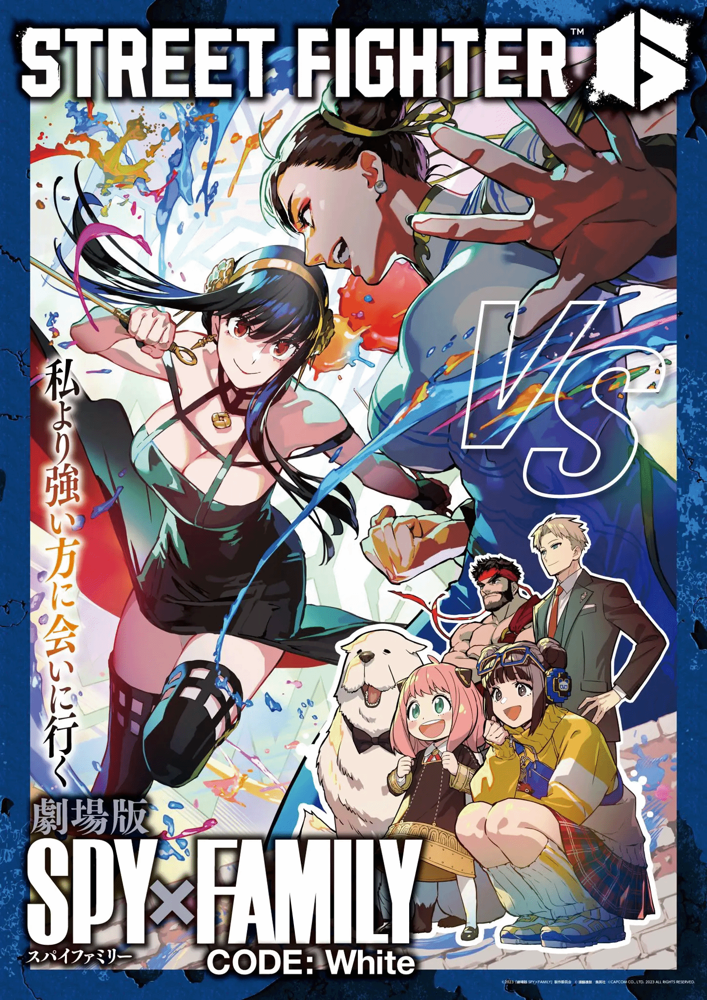

# 一张海报的感受

好消息好消息，街霸6和间谍过家家联动了！双厨狂喜啊！今天就和大家来谈一谈我的感受

## 海报

## 感受

格斗游戏和其他有合作的游戏(比如lol，dota)相比，不一样的地方是什么？答案就是格斗游戏是单干的！团队游戏，输赢和队友是有关系的！赢不单单是为了自己，也是为了一起努力的队友！如果打游戏不是为了赢，那和咸鱼有什么区别！所以我是带着好胜心玩游戏的，玩什么游戏都有好胜心，包括格斗游戏！上述的海报，有段日语大家可能没看懂，最左侧竖着的一排字，我给大家翻译下，**我要去见比我更强的人**！看完这句话，真的太有感受了

因为格斗游戏没有队友，输了负担没有这么大，输只是因为自己菜！在游戏中付出所有的一切，都是为了去见比自己更强的人！想想当初我刚玩街霸6，初始定级只有三千分，打到五千分就打不上去了。如今到了两万不到，又打不上去了，这就是不断变强的过程。然后大家想一下，为了见比自己更强的人，比你强的人，你赢的概率有多大呢？

这时候大家就会发现一个东西，就是我在我的[格斗板块](../../index.md)有提到的，格斗游戏的"不愉快"，他本身和赢这个行为是矛盾的！因为你不可能轻松赢下比你更强的人。所以我们不能以以前的思路去理解格斗游戏，格斗类型的游戏更像是修行，一个超越自己的修行！输才是常态！(那谁打游戏为了输呢)。

这个时候我又想到了一句挺装B的话，打格斗游戏，对手永远只有一个，那就是自己！被比自己更强大的人击败了，很正常，但他并不是你的敌人，他反而在战斗中教会我们一些很重要的东西，方便你变的更强，追赶前面的人的脚步。其实感觉这个和现实生活还是很像的，大多数人，大概率都不可能一帆风顺，顶住逆风，才能突破！

我很多朋友，被我打退坑，或者他们被虐的很惨的时候，多少有点放弃了，不想玩不想上分，如果可以的话，我希望这次分享的，可以让受挫的朋友重新找到格斗游戏的意义，或者感悟一些与现实关联的东西！最后当然希望他们回坑继续挨揍！(狗头保命)
