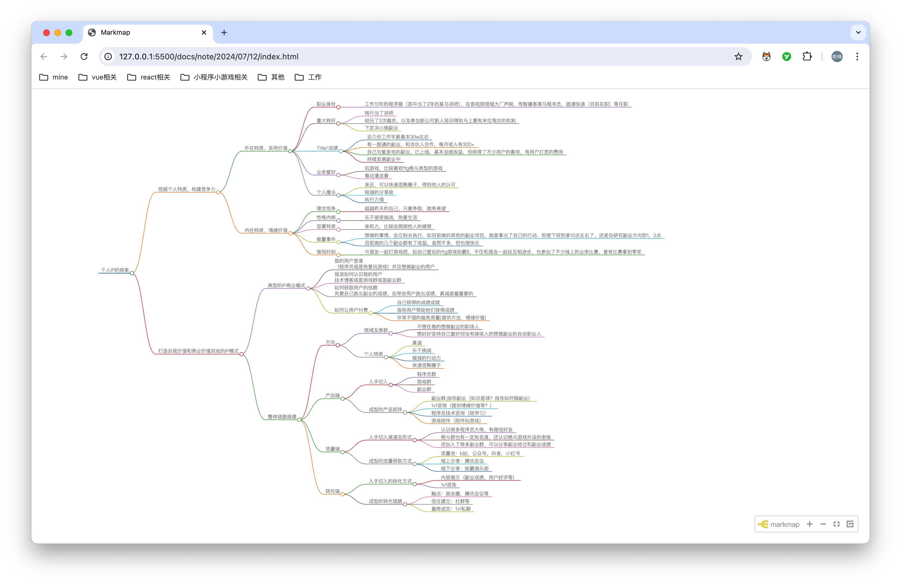

# 产品介绍作业

## 整理课程内容

我先整理了课程内容，截图了个人觉得比较重要的

## 梳理个人优势

自己之前有幸看了立心老师的笔记，所以以前有提前整理过，现在又改了一版

## 收集我觉得可以做的资源

## 我的产品

【产品名称】1v1交流
【产品内容】
    加入我的副业基地群
    梅的聊产品限时优惠，只要9.9元/半小时
【解决问题】
- 可以问我的故事（如果你需要倾听，也可以让我不说话）
- 可以咨询我做过的副业，如果你执行能力强，说不定你可以模仿并且超越
- 可以聊人生，提供情绪价值，提供正能量。每个人都有独一无二属于自己的特点，你就是最棒的你
- 副业基地群，每天都会分享别人赚钱的小案例，打开思维，变现从来不是因为你的能力，而是你的认知
【为什么选择我】
- 工作10年的程序猿，有大厂经历，年薪30w加
- 厌倦职场压榨pua，尝试多种副业都有小收获
- 前某马金牌讲师，对自己聊天提供情绪价值，教学能力都非常自信
【适合人群】
- 想找人聊天
- 想了解我尝试过的副业
- 随便聊聊（认识我😁）
【产品形式】1V1
【价格】9.9 或 随喜

