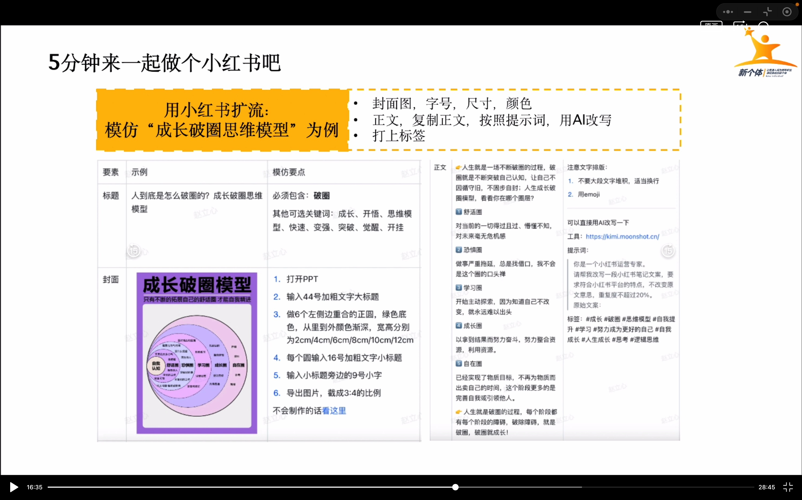

# 商业模式打卡作业

## 整理课程内容

## 这节课印象最深的点

### 商业问题的常见问题里

关于**太小众不好卖**这个点，感谢立心老师的开导，因为我自己的爱好就是特别小众的领域，那就是**格斗游戏**。立心老师用了熊猫血举例，形象生动，任何小众领域，放在全中国，至少也有一万的受众。

关于**价格与价值**这个点，有价格+出售产品的动作+价值足够深度，也醍醐灌顶，的确之前我设计的东西，并没有足够的深度，出售产品的动作也不行。

关于**没有自媒体渠道**这个点，我大概知道如何去获取我的用户，如何找到我的用户。

关于**每天给用户做销售，没有营收提升?**这个点，的确我没有有效激发对方的购买意愿，所以变现的少

### 抄范文和罗马的举例

这真的说的太好了！我自己本身也踩过坑，以为创新才是最对的，通过做的几个副业，创新的几个结果死的都很惨。这么多成功的大佬，他们替我们走过多少坑，最后走通了一条路。我们就应该去好好模仿。模仿是最大的捷径，普通人先要学会复制，才能成功！

### 这么简单做不出来

这一个知识点也很有意思，总结的也特别到位，意识问题和能力问题。听完老师的讲解，我觉得自己不管哪方面都很欠缺，但**找答案的确值得付出时间**，自己要有耐心，好好去探索！

## 模仿至少一个环节