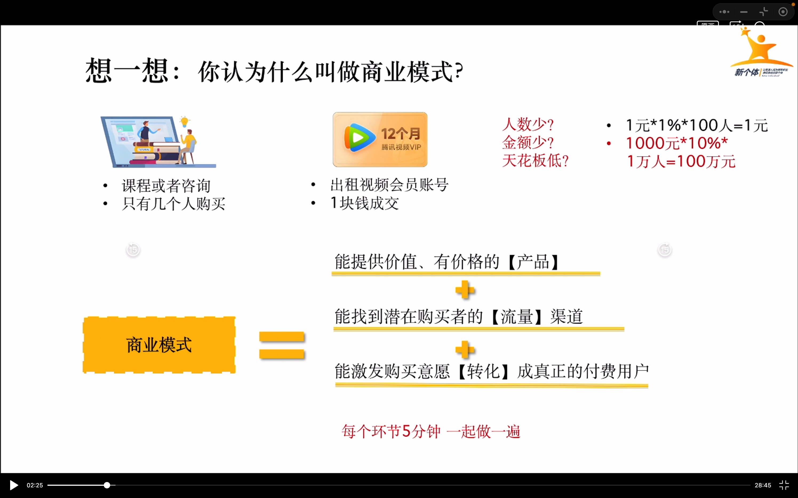
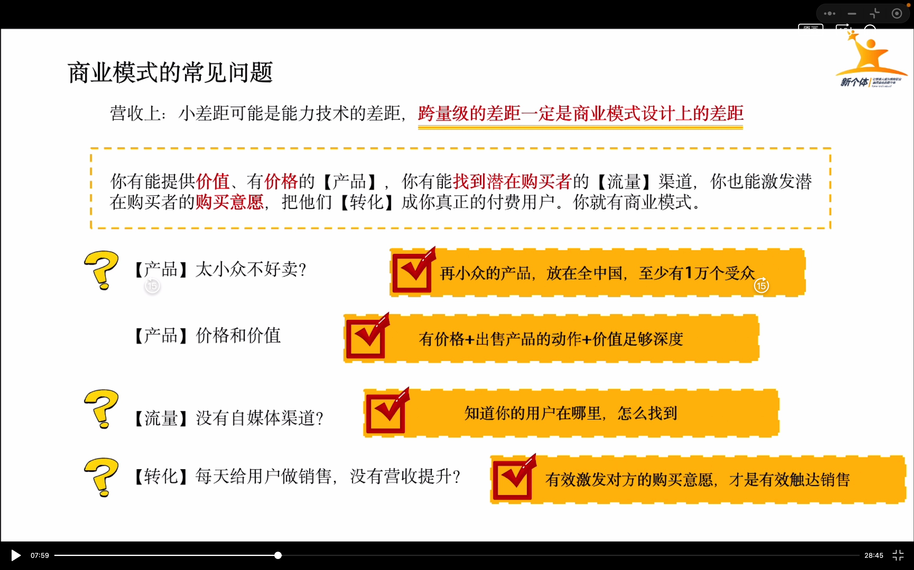
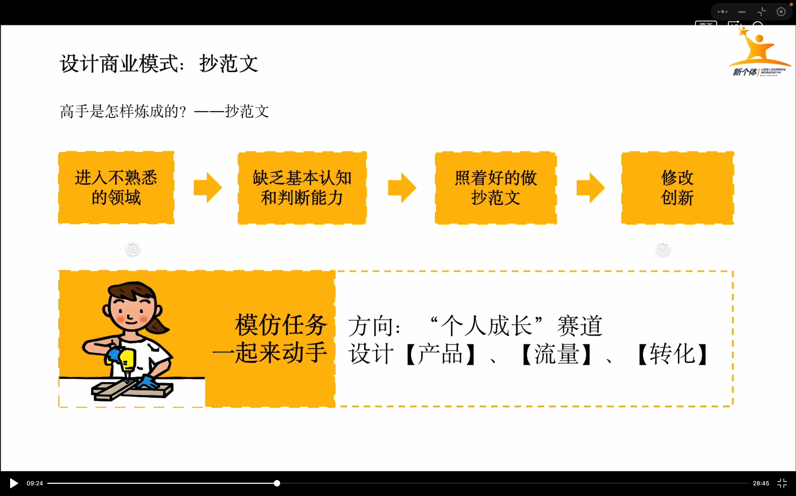
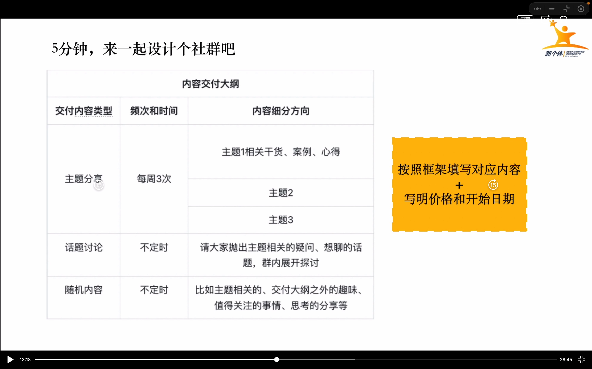
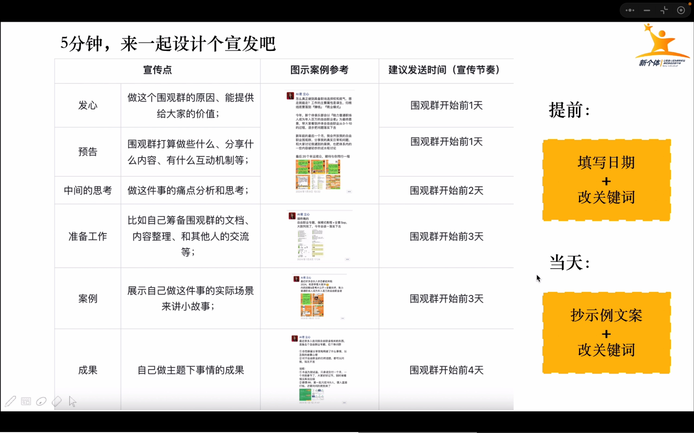
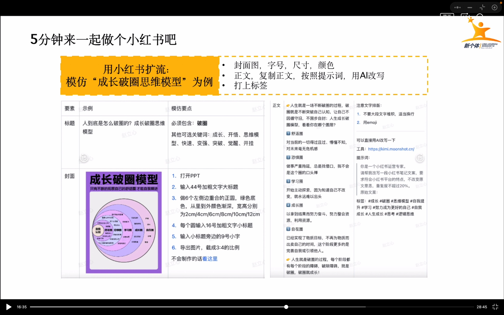
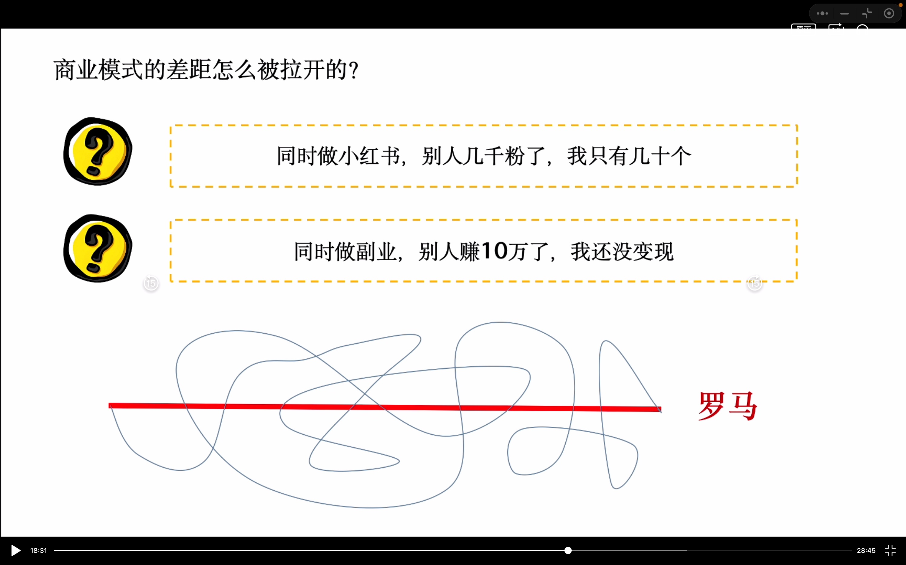
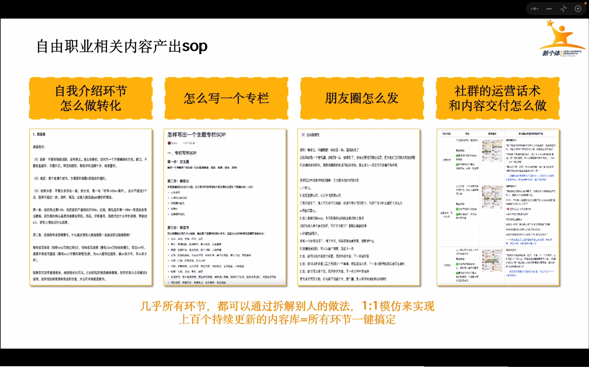
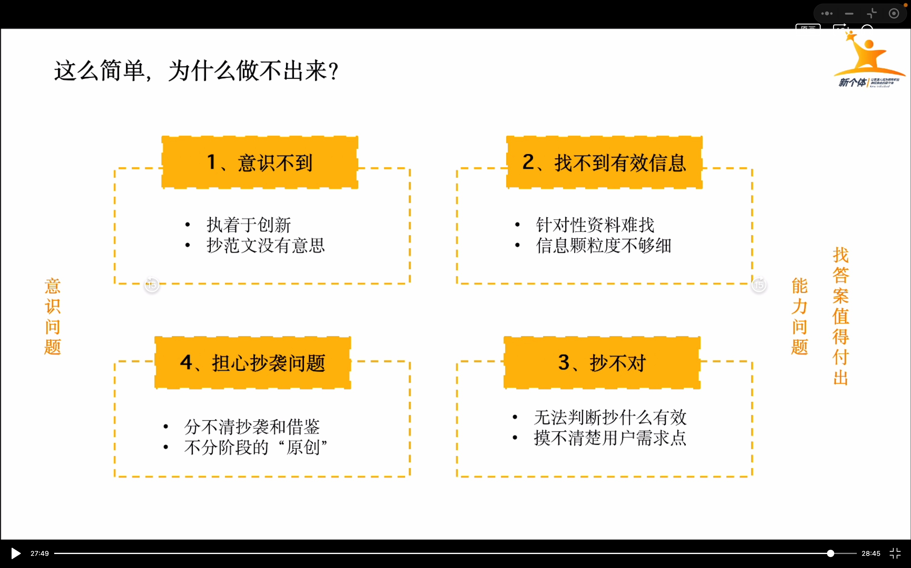
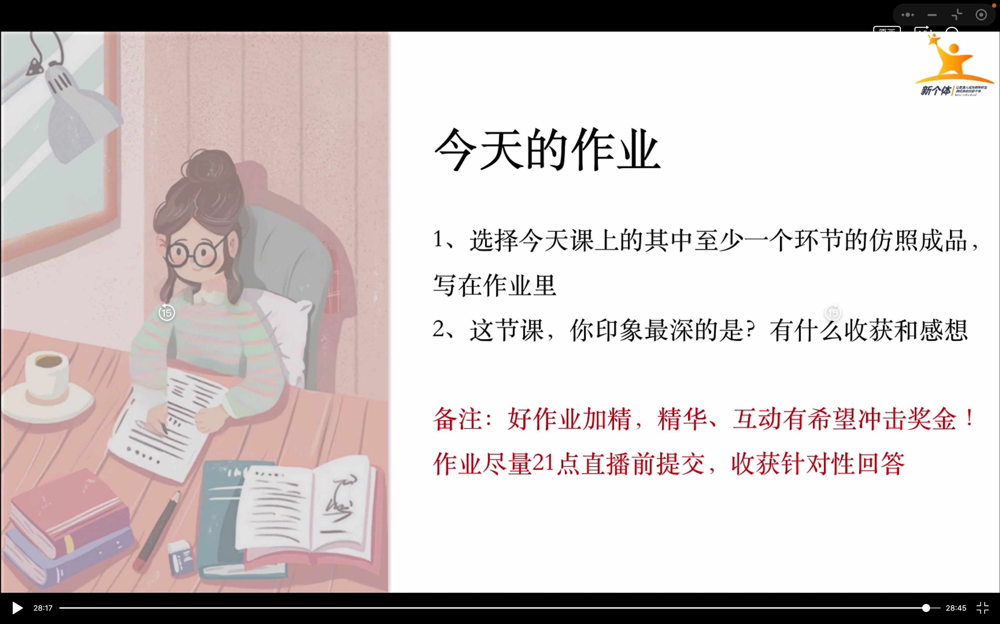

# 商业模式打卡作业

## 整理课程内容

## 这节课印象最深的点

### 商业问题的常见问题里

关于**太小众不好卖**这个点，感谢立心老师的开导，因为我自己的爱好就是特别小众的领域，那就是**格斗游戏**。立心老师用了熊猫血举例，形象生动，任何小众领域，放在全中国，至少也有一万的受众。

关于**价格与价值**这个点，有价格+出售产品的动作+价值足够深度，也醍醐灌顶，的确之前我设计的东西，并没有足够的深度，出售产品的动作也不行。

关于**没有自媒体渠道**这个点，我大概知道如何去获取我的用户，如何找到我的用户。

关于**每天给用户做销售，没有营收提升?**这个点，的确我没有有效激发对方的购买意愿，所以变现的少

### 抄范文和罗马的举例

这真的说的太好了！我自己本身也踩过坑，以为创新才是最对的，通过做的几个副业，创新的几个结果死的都很惨。这么多成功的大佬，他们替我们走过多少坑，最后走通了一条路。我们就应该去好好模仿。模仿是最大的捷径，普通人先要学会复制，才能成功！

### 这么简单做不出来

这一个知识点也很有意思，总结的也特别到位，意识问题和能力问题。听完老师的讲解，我觉得自己不管哪方面都很欠缺，但**找答案的确值得付出时间**，自己要有耐心，好好去探索！

## 模仿至少一个环节

## 模仿至少一个环节

### 产品

- 梅的陪伴（游戏社群以游戏为主，9块9的永久陪伴！）
    - 梅有朋友陪伴的坏心情，我们陪你玩！
        - 众所周知，游戏的最高配置，是硬件嘛？我觉得不是，而是没有朋友一起玩！
        - 比如之前的年度游戏双人成行，比如派对游戏煮糊了等等。
        - 如果你缺少朋友一起玩游戏的这个配置，欢迎加入我们
    - 梅有游戏技巧的小菜鸡，我们教你玩！
        - 我玩的菜，输多赢少，好难受！
        - 不用怕，群主也是个菜鸡玩家，但就是喜欢玩，可以交流心得
        - 群里有各种类型的游戏玩家，有各种攻略分享，手摸手指导，陪伴让你变得更强
    - 梅有游戏目标，我们一起定游戏目标一起冲！
        - 游戏玩的都没激情，电子YW？
        - 没关系，大家可以一起玩个游戏，一起定目标，一起冲！
        - 比如黑悟空一起通个关，比如王者荣耀一起冲个王者段位等等。
    - 梅有玩格斗游戏的朋友，我们一起fighting！
        - 群主是个格斗游戏爱好者，有专属的格斗群，有兴趣欢迎加入围观
        - 虽然群主玩格斗菜，但街霸6这款格斗游戏，也是个大师段位的“高手”，指导没到过大师的小萌新还是绰绰有余的
        - 减少格斗游戏负反馈，值得你拥有！如果你想体验格斗游戏，欢迎加入格斗群
    - 梅有人一起做副业，我们一起研究做副业一起搞钱！
        - 群主还是一个搞副业的执行力贼强的“大佬”
        - 副业基地群每天会分享一个搞钱思路
        - 可以围观群主日更公众号
        - 打游戏的同时，空闲时间在做做副业赚钱，不香嘛？有兴趣欢迎加入围观
    - 梅有谈心开导你的朋友，我来当你的专属树洞！
        - 梅的聊是1v1聊天的项目，文字，语音，视频都可以！欢迎找群主咨询
        - 我孤独寂寞冷了，想找人聊天，可以找群主
        - 群主好逗好喜欢，我想好好认识他，可以找群主
        - 最近有点emo了，想吐槽各种事情，想聊各种话题，群主来当你的树洞，可以找群主
    

### 社群-内容交付大纲

| 交付内容类型     | 频次和时间     | 内容细分方向                                                 |
| ---------------- | -------------- | ------------------------------------------------------------ |
| 每日随缘游戏打卡 | 每天一次或N次  | 今天玩了什么欢迎分享，带上#打卡文案，开始你的分享！          |
| 呼朋唤友         | 随时在群里召唤 | 在玩什么找不到朋友，群里喊下！或许就有小伙伴有一起玩的呢！   |
| 游戏话题讨论     | 随时在群里讨论 | 大家可以抛出自己游戏的话题，问游戏上的问题，分享攻略等都可以，群内展开探讨！ |
| 游戏目标制定     | 随时在群里制定 | 大家可以一起定个短期目标，可和群友组队一起冲。如王者荣耀这个赛季组队一起冲个最强王者等！ |
| 梅的格斗游戏教程 | 不定时         | 群主不定时更新格斗游戏教程，分享在群中！                     |
| 副业群报喜       | 不定时         | 副业基地出成绩的小伙伴分享给大家一起学习！                   |

交付内容大纲：

1. 每日随缘游戏打卡，频次为每天一次或N次，主要内容：今天玩了什么欢迎分享，带上#打卡文案，开始你的分享！
2. 呼朋唤友，频次为随时在群里召唤，主要内容：在玩什么游戏找不到伙伴，群里喊下！或许就有小伙伴有一起玩的呢！
3. 游戏话题讨论，频次为随时在群里讨论，主要内容：大家可以抛出自己游戏的话题，问游戏上的问题，分享攻略等都可以，群内展开探讨！
4. 游戏目标制定，频次为随时在群里制定，主要内容：大家可以一起定个短期目标，可和群友组队一起冲。如王者荣耀这个赛季组队一起冲个最强王者等！
5. 梅的格斗游戏教程，频次为不定时，主要内容：群主不定时更新格斗游戏教程，分享在群中！
6. 副业群报喜，频次为不定时，主要内容：副业基地出成绩的小伙伴分享给大家一起学习！  

### 宣发

还在设计中

### 小红书

还在设计中
