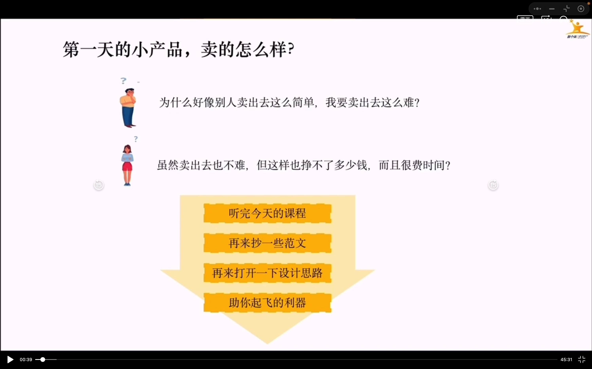
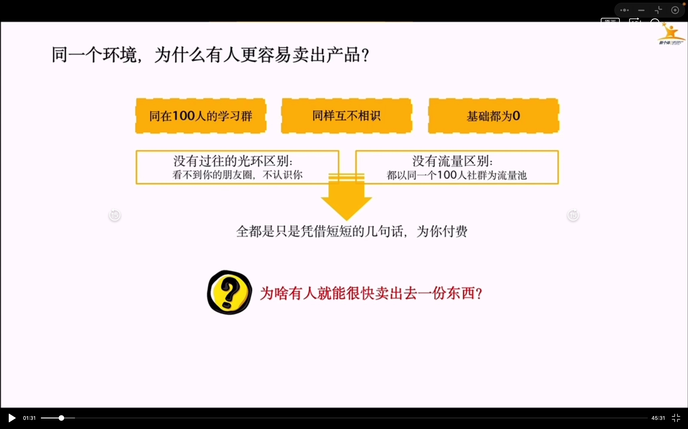
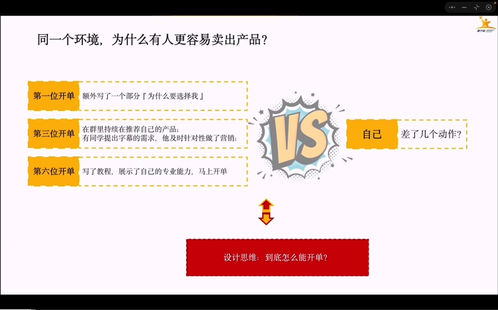
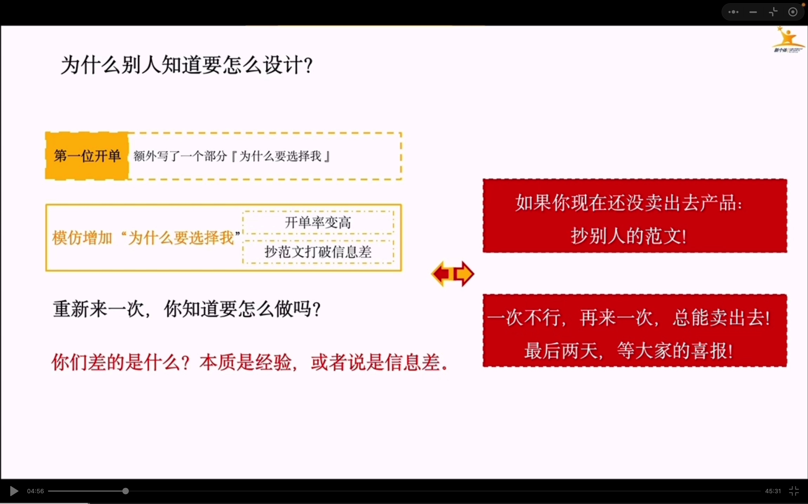
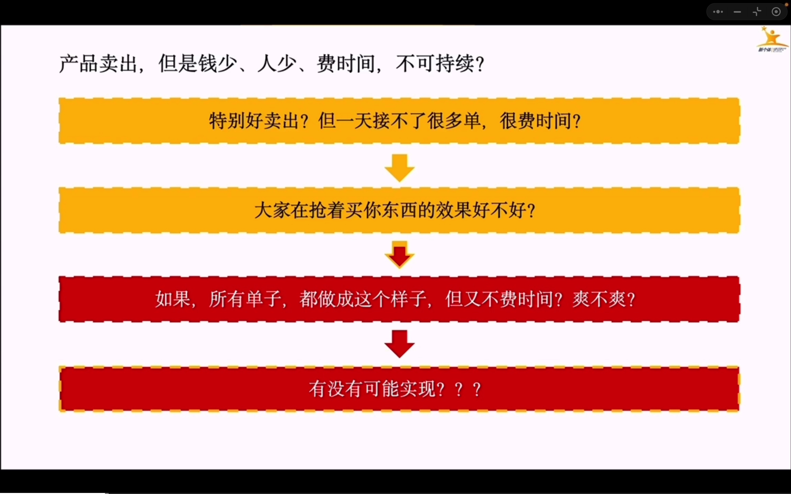
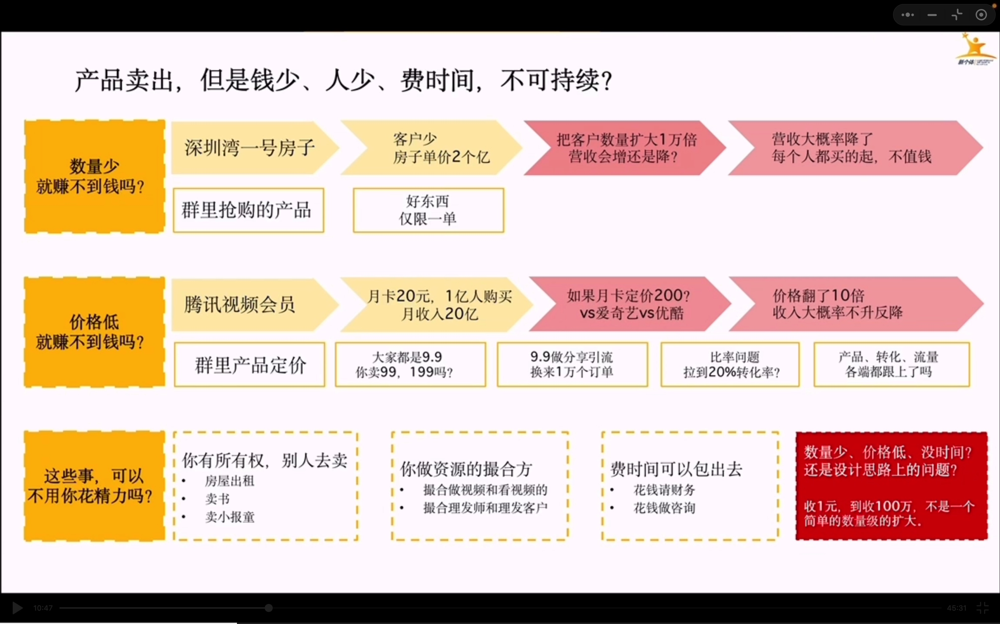
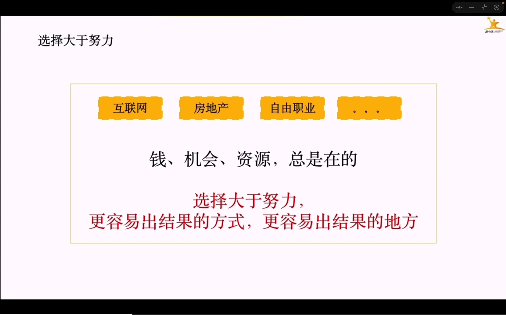
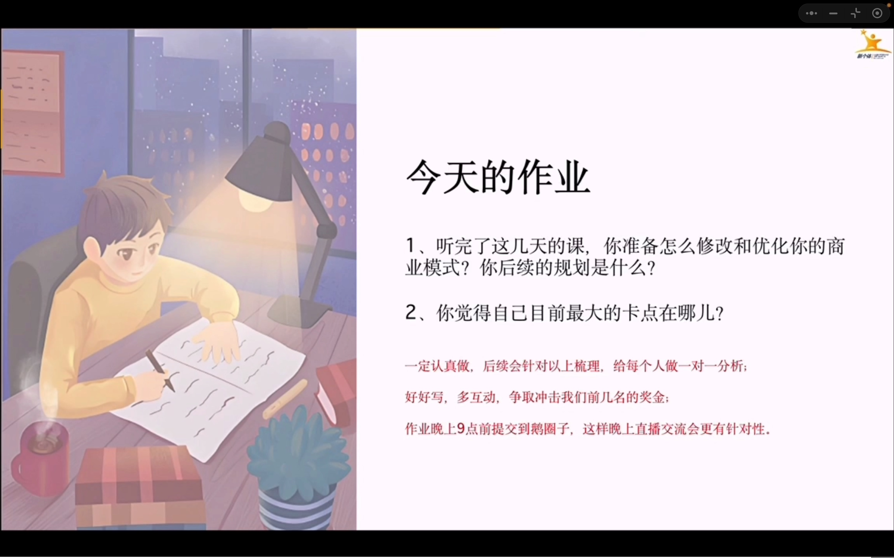

# 自由职业变现

## 课程内容部分截图

## 作业

### 如何修改优化商业模式？

### 后续规划是什么？

### 卡点在哪里？

我目前的产品是2个陪伴群，分别一个游戏陪伴群，一个副业陪伴群
人群分别是想找人一起玩游戏，找人一起陪伴做副业的伙伴
现在的问题是后续如何变现我还没有好好思索
我已经尝试了
游戏群，比如指导如何玩我擅长的游戏，出游戏教程等，有用户打赏过，但变现不多
副业群，比如自己知识付费不少，加了不少副业群，每天在自己基地群分享副业信息差，日更公众号，陪伴聊天等，成绩是这次迅速开了3单
现在顾虑的是两者并行是否可行，我自己个人IP也是以这2者结合在一起，喜欢玩游戏并为了自己爱好自由，拼命做副业的阳光老男孩
现在缺流量，我重点尝试了公众号引私域，小黑盒APP（游戏玩家用的比较多可能？）引私域，小红书，抖音，B站还没开始弄。
目前有的动作，在游戏群引入私域加入我的游戏陪伴群，玩游戏并且有兴趣做副业的可以再加入副业群
还有的动作，在副业群引入私域加入我的副业基地群，做副业空闲时间有兴趣减压玩游戏的可以再加入游戏群
我做了很多副业，目前就专注个人IP公众号和AI爆文公众号2个副业项目，每天都有收入
不知道现在这个状态到底算怎么样，路走的到底对不对。

其实我自己本身没有什么光环，或许又有什么光环。在大厂呆过，也当过某马的讲师。技术上我不聊太多，因为我觉得很普通。但当讲师我想聊一下，招我进去的主管觉得我是有天赋的。有分享欲，也很愿意表达。我也感觉或许是这样。我能很好的倾听学生的发声，我也有较好的表达能力，带过不少0基础入行IT的萌新。耐心，亲和力，温柔，这是学员对我的评价。教学教的好，讲的细也是他们对我的评价。所以我在群里卖出去的产品，梅的聊，我是自信的。因为我有正能量开导能力。你想大环境不好，学员找不到工作，要给他们模拟面试，要给他们开导抚慰，要引导他们驱散他们的负能量负面情绪等。这是我们讲师除了上课以外的工作，面试辅导就业辅导给学员树立信心。

我游戏陪伴群出攻略教学，也是因为自己当过讲师的原因，有授课经验。陪聊天是因为我辅导就业聊太多了，觉得我也喜欢聊天。

自己编程技术的话，只能说不算特别差，但也不是特别拔尖，但我不想走技术这条路。因为在我看来，即使在拔尖的技术人才，最终也是耗材。

好像说的太偏了，想到哪就说到哪，希望老师不要嫌弃。

最后希望能被老师点名，聊一聊我现在的状况对不对，目前在职某通快递公司回一线做开发了。每周固定2天要加班到9点，外加新人培训有说公司即将有末尾淘汰机制。焦虑是我变强，是我开卷自己的副业。我做了2个多月的副业。目前的成绩就是这样。

