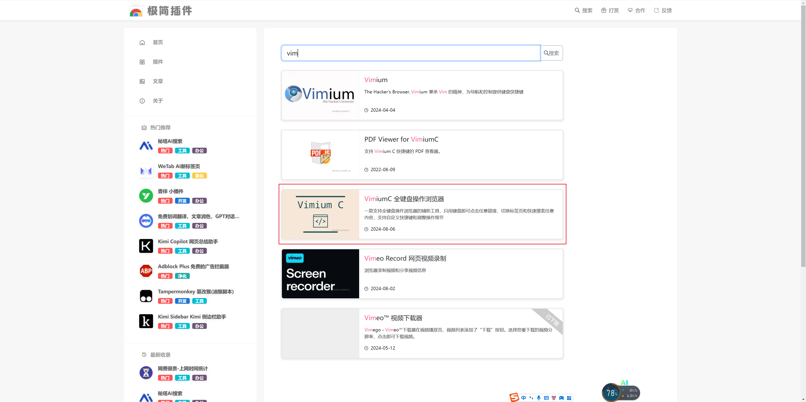
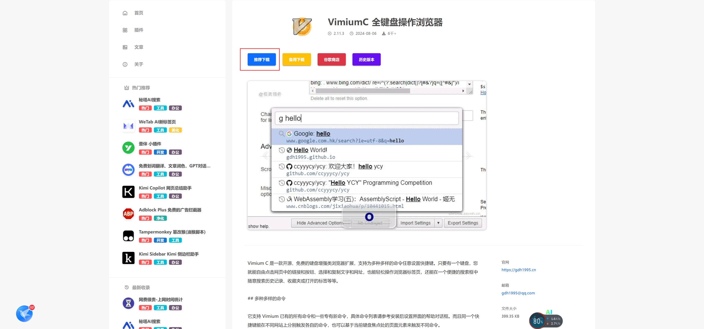
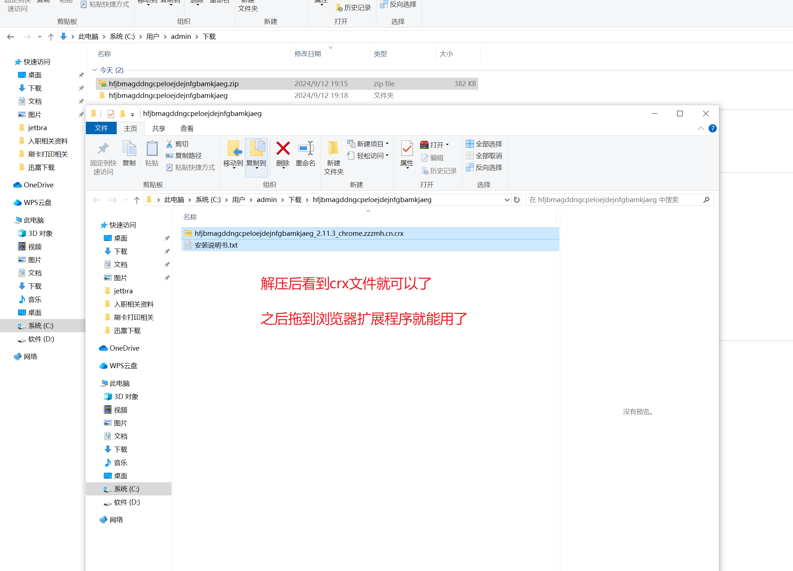
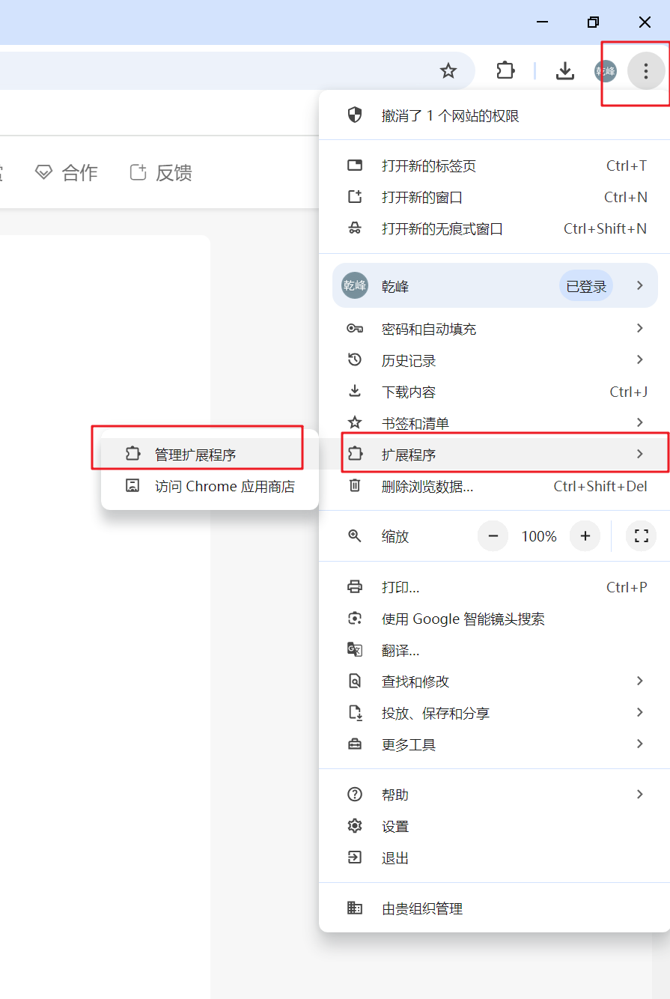
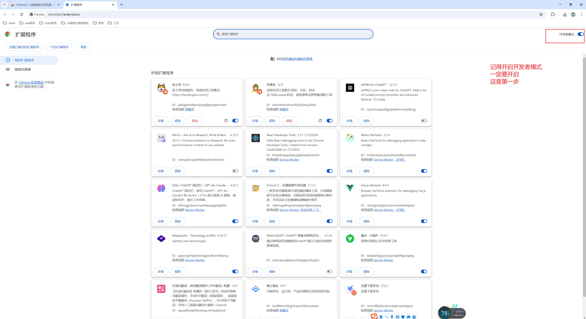
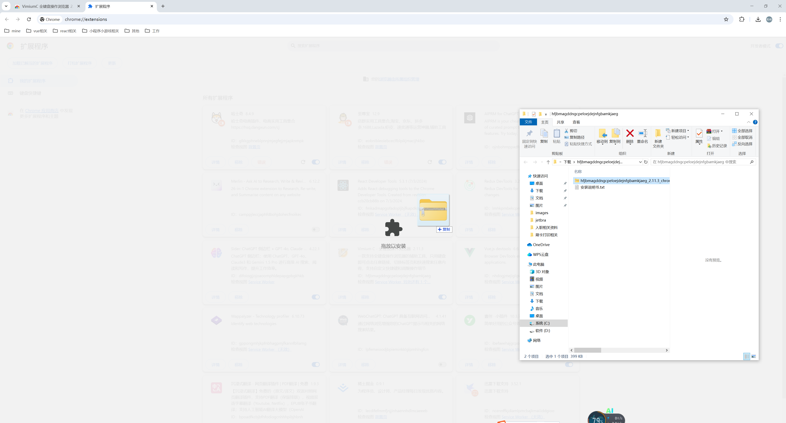
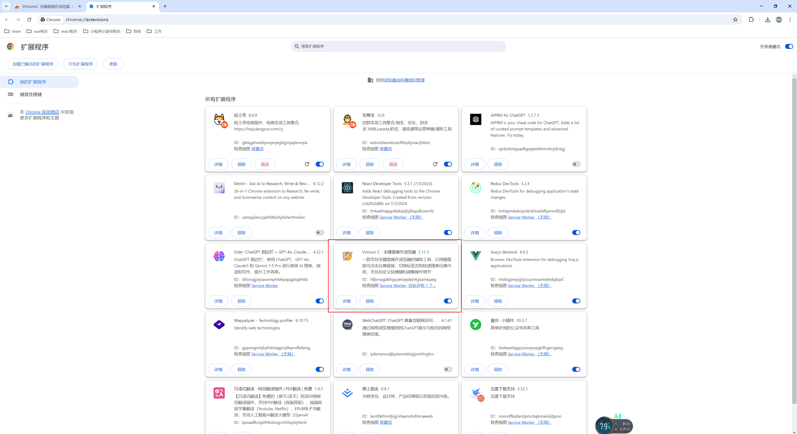
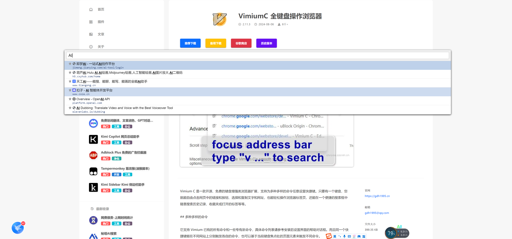

# Vimium C - 全键盘操作浏览器教学

## 下载并安装vim谷歌插件

1. 不需要魔法，可以使用国内网站[极简插件](https://chrome.zzzmh.cn/index)下载谷歌插件

2. 进入网页后搜索**vim**

3. 点击进入下载页面，点击推荐下载

4. 下载插件后记得解压，可以看到文件夹中的内容，有个crx文件

5. 点击谷歌浏览器扩展程序

6. 开启开发者模式

7. 把前面第四部的crx文件直接拖拽进这个页面

8. 当你看到界面中有这个插件后，说明就安装成功了！可以愉快使用了

## 直接使用最常用的命令

### 搜索收藏夹：大写的B（shift + b）

可以搜索收藏夹的内容，比如作者我收藏了一些AI的网站

### 更多指令教学可以有兴趣等我来教

可以先看帮助，按问号（shift + /）

如果需要更直接的手摸手指导，可以找我咨询，不要99，只要9块9

