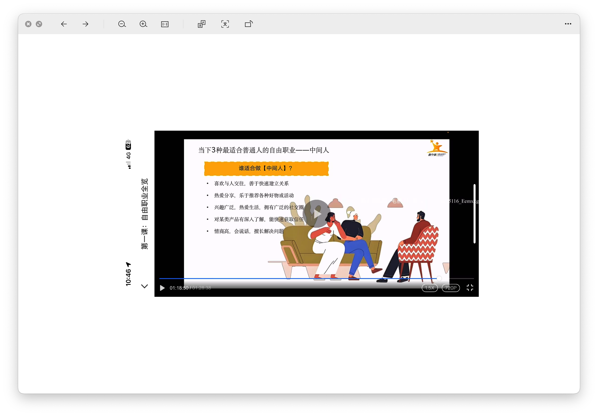

# 个人定位选择

## 自我评估

### 自由职业需要哪些关键技能，自由职业现状

- Q: 你有多强的意愿不想上班一辈子？
- A: 非常强的意愿，每天上班就像上坟，感觉都在浪费生命

- Q: 你愿意为做成自由职业付出多少时间？
- A: 即使996，每天也坚持做副业！（目前还在继续日更公众号）

- Q: 你愿意为自由职业付出多少金钱？
- A: 在经济允许的情况下，能出多少就出多少！目前知识付费应该有2w+

- Q: 你愿意为做成自由职业放下面子嘛？
- A: 在我看来，面子是最不值钱的东西，如果能提供价值给别人就是值得的！

- Q: 你能接受多少次失败？
- A: 无数次，失败乃成功之母，下一次我或许就能成功！（24年7月底正式开始做，到现在感觉都没成功过）

评分应该在60~80之间

### 维度1

维度1自我评分：16分

### 维度2

维度2自我评分：16分

### 维度3

维度3自我评分：20分

### 维度4

维度4自我评分：6分

### 维度5

维度5自我评分：4分

### 维度6

维度6自我评分：6分

### 维度7

维度7自我评分：6分

### 多维度总分

16 + 16 + 20 + 6 + 4 + 6 + 6 = 74

很高兴自己处在60~80分的区间，有自由职业的潜能，希望在专项上做一些补足，早日自由职业成功！

## 金字塔

处在阶段2，目前副业累计收入超过了1w！目前需要找准定位，找到适合自己的商业模式！

## 三种自由职业类型

### 咨询师

曾在某马程序员担任讲师的我，感觉自己也是当过"咨询师"的！我属于比较耐心，也愿意倾听学员问题，发现学员问题并解决。只不过在某马毕业后，就很少涉及咨询师了，但那份当讲师愿意分享愿意倾听的灵魂，依旧还在！

后续如果做咨询师，希望能在副业有更好的成就，然后担任个做副业的启蒙老师，感觉也不错

### 自媒体博主

我的表达欲分享欲还可以，也不害怕镜头！并且在B站有分享过自己的一些编程教学，游戏教学等。就是对市场需求不是特别敏感，也不太会抓流量！

流量型内容不太会做，我觉得是致命伤，所以可能自媒体博主是最不适合自己的！

### 中间人

在关于做分销这一块，我还是有点经验的。去年副业收入有一部分组成就是分销！个人还是比较喜欢交朋友，愿意分享副业信息差，副业项目给自己社群的伙伴！情商不低，也算会说话，所以中间人对于我来说，还算可以！

### 三种类型总结思考

所以个人感觉，我更适合咨询师和中间人的合体型！不一定要很死板的只搞一个，比如可以让新手小白咨询，该怎么做副业，顺带便直接当中间人，安利分销产品！目前就想到这么多，后续有想到其他的再补充

