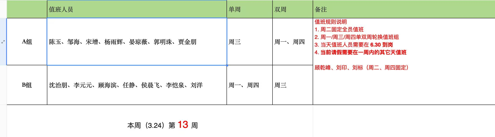
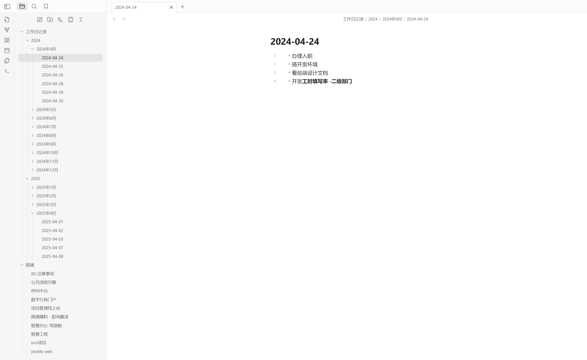

# 圆通爆料-职场霸凌

大家好，我是用户体验中心的前端开发-顾乾峰。很抱歉以这样的方式，让大家更加熟悉了我。
今天，我想跟大家聊一聊，我在公司工作中，遇到的职场霸凌。
希望引起大家的思考，以及看看公司会如何处理霸凌事件！

## 1. 优秀新人后的奖金剥削

去年有幸拿到了优秀新人的奖金，原本是件很开心的事！但直属领导在之后通知我说**重要的是荣誉，而不是奖金**，并且告知了以前所有的奖金都是会缴纳一部分作为团建。
那时候我觉得也就算了，自己毕竟也是有荣誉感的，但后面想想，还是有点不对劲。
团建我是没有参与过的，奖金是否用于团建我也不知道，那这钱到底进谁口袋了大家自己想！
下面请看关键证据


## 2. 绩效宣贯后的加班制度

前一阵子的绩效宣贯，想必大伙都知道了，懂的都懂，这里就不赘述了。
在绩效宣贯后，我们组立刻就制定了加班政策，在国家反对加班的情况下，我们组领导顶风作案，美其名曰，大家卷起来（才能拿更好的绩效？）
那大家都卷了，组里的C就不打了嘛？
下面请看加班制度截图，领导亲自制定


## 3. 员工提出看法后的逆天发言

其实在绩效宣贯后，就提出了自己的看法，并准备了一份正常的邮件模板，模板如下
```
尊敬的领导:您好
本人- ，工号- ，公司-部员工，现就公司近期拟将员工固定工资调整为“底薪+绩效”的薪酬结构调整事宜，正式向公司表明立场及意见如下:不同意薪酬结构调整理由如下:
1、公司仅通过口头宣贯方式通知薪酬结构调整，未出具任何书面文件说明调整依据、绩效核算标准和保障措施。该调整缺乏透明性和合理性，可能导致本人劳动报酬权益受损
2、本人历史工资流水均以固定形式足额发放，公司当前的调整方案实质变更了劳动合同核心条款，但并未与本人协商一致，亦未提供书面变更协议，不符合《中华人民共和国劳动合同法》第三十五条规定:“变更劳动合同，应当采用书面形式”。
现正式提出诉求:恢复原本的薪资结构
若公司执意调整，请提供薪资结构调整的合法依据、调整后薪资不低于原先标准的书面承诺以及变更后的劳动合同补充协议草案
```
对了，大家也可以看下钉钉，工作平台->人事助手->工资查询，看下自己的基本工资多少，工资组成是什么，看完就有惊喜！

在发邮件前，我也得到了直属领导类似威胁的话，大致意思就是"你发邮件你就完了"，但为了维权，表达自己的看法我还是发了，导致后面的各种霸凌

顺便提一嘴，领导在全组开会的时候，有逆天发言，比如
- 仲裁也听圆通的
- 公司从来没有n+1过，都是n减几（我的n是1，所以我还要倒贴？）

这个我有录音，为了防止撤回，我会在大群发一份，在炒菜群也发一份，欢迎转发！

## 4. 职场的太极来回踢皮球奥义

不同意的绩效宣贯后，人事这边表示说反馈到总部了！在此期间，我有询问过具体情况如何，就看到了职场的太极踢皮球奥义
人事让我找领导，领导让我找人事，不管谁都是已读不回，未读不回的状态
直到我去问了英总，人事才找我聊，并且说，即使我没找英总，她这一阵子也会找我！

最厉害的是，聊前，抢了我的手机！说大家都是朋友，不要搞录音这种事情，否则就不聊了！
如果真的没有问题，为什么怕录音？可惜我在会议室门口就开好了录音，也保留了关键的证据

聊天内容大致也是职场画饼的套路，大家懂的也都懂，这个录音1个多小时，有点长，就不发了！
如果有兴趣也可以私聊我

## 4. 裁员补偿的恶心套路又见踢球奥义 

今天我接到了谈话，大概意思就是，让我交接半个月，给赔偿，好聚好散！

这里讲个热知识，N+1赔偿的N，是看你在公司干了多久。
不满半年，就是0.5，超过半年，就直接算1，举个例子
你干满一年，之后多一天，你的N就是1.5
你干满一年半，之后多一天，你的N就是2

的确"好聚好散"，交接半个月后，在4月24日之前就把我干了，而我正好是4月24日入职的，简单点说，就是原本我可以多半个月工资

对了，我有个好习惯，记录了每天的工作，并且加班做了什么


这就是好聚好散嘛，明明多交接几天，N可以多0.5，但就是定在你没满1年的那一天

并且又能看到踢皮球的奥义，人事说是我领导定的，领导说是人事定的（统一：你找我说这个没用）

谈赔偿恶心人非常爽快，但是交涉的时候，又是未读不回


## 5. 总结

其实我也只是个普通人，也没有什么话语权，但工作10年多了，还是第一次遇到这样的事
环境越来越恶劣，所有的打工人也有责任
因为卷，一个人干两个人三个人的活，导致外面就有人失业。
因为压榨不敢发声，导致压榨就越来越凶猛，你不干有的是人干！
牛马跪久了，就站不起来了，而我只是想勇敢地站起来下！
