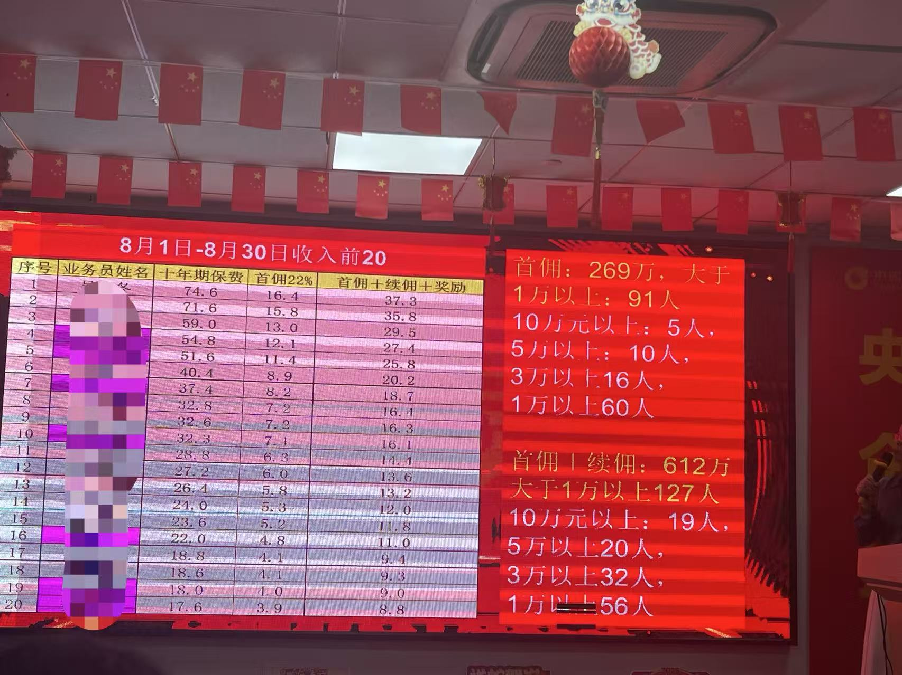
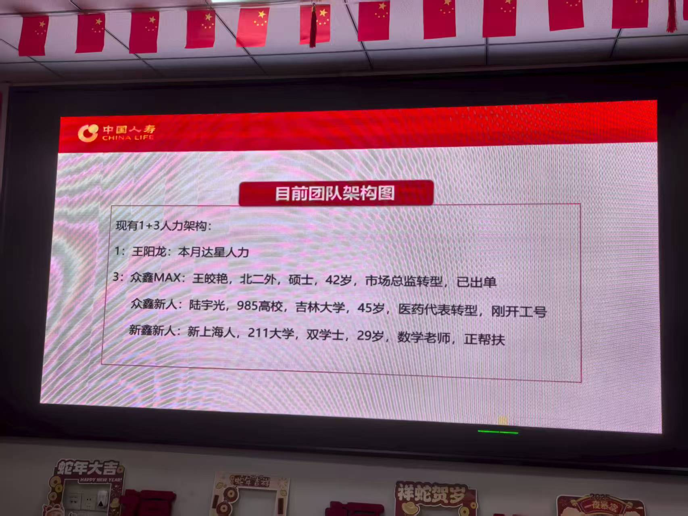

# 转行经历分享

大家好，我是梅利奥猪猪（自媒体名称），老（小）顾，前锋（朋友，同事对我的称呼），峰哥（黑马学员对我的称呼），反内卷ZX（一家特别卷的公司里的同事对我的称呼）。

目前我已经转行一两个月了，现在是国寿的保险销售人员

PS: 代码其实也在写，只是换了一种方式，接单做副业这种

然后这次主要分享的是，为什么选择去保险行业尝试，主要有以下原因和大家分享下

## 找工作

我在05年4月份失业的，也失业好几个月了。

当然在失业时也尝试了不少副业，每个月的副业收入估计也就千把块，相比之前的工作收入月入20K~30K还是差很多的

因为有房贷各种贷，所以媳妇还是比较焦虑的，在7月份的时候，就明示暗示希望我赶紧去找工作，父亲也觉得“啃老”不可能给我啃一辈子的，希望我能放低要求，继续找之前行业的工作。

我自己也有过尝试，虽然在boss上也有和人事沟通面试的机会，但每份工作，基本都是“钱少，事多，离家远”

大环境不好，行情不好的IT，现在跳槽也基本都是平薪甚至降薪跳！想再拿到25k左右的薪资，是有点难度，且自己也已经33岁了，有机会面试都已经非常不容易了！有机会的面试基本都在10K~20K之间，这就是钱少（上份工作是因为降薪才走的，如果找薪资低的工作，不如留在之前的公司）

还有做IT开发一直都是加班的，我深知在行业中一直加班的痛苦，每天都很疲惫！不加班的开发工作实在是太少了，很难找到，即使我的老东家“某通”，我走的时候，一周也要求至少加班2天，这就是事多

还有就是我现在新家在顾村比较偏的郊区，附近根本没有合适的开发工作！所以找开发岗位都是“离家远”，甚至我之前的每份工作由于路远和加班，我一般都选择租房，哎

也就是因为这样，我如果继续做之前的老本行，基本就是只能选“钱少，事多，离家远”。而且开发技术岗位，“青春饭”工作名副其实，它并没有和时间做朋友，但凡越老越吃香，我肯定也愿意继续干！现在继续选择做开发，又会进入加班循环，努力加班，赚窝囊费，被裁，找工作，在继续加班，循环，直到35岁+，找工作要求降的更低，直到再也找不到合适的工作！

那为何不转行呢？那为何不转行呢？那为何不转行呢？

这个时候我就开始看其他行业相关的内容，其中“中国人寿”，大多数人印象不好的“保险”行业映入我的眼帘。

因为我自己本身对保险也不是特别抵触，身边也有个曾经是做IT后面转行做保险经纪人的朋友（通过他我媳妇也买了一些保险）且看到工作时间非常自由（毕竟销售大家都懂的），10点上班打卡开会，10点半，打个下班卡就可以走了 （10点到10点半是早会时间）

而且和我之前工作的性质完全不同

钱多，是看销售的能力，你每个月出单多，甚至是能超过我之前最高的年薪收入40w的，但还是那句话，越努力越有钱，努力能看到回报（IT加班时看不到努力就有回报这个希望的）

事少，其实做保险事也不少，但如果你是个咸鱼，满足每个月的最低业绩，那就算“事少”,但还是那句话，越努力越有钱，努力能看到回报（IT加班时看不到努力就有回报这个希望的）

离家近，其实工作地点离我现在的家位置比较远，但也还好，因为我面试的中国人寿上海虹口分公司，在我媳妇上班公司附近，我每天搭她车上下班就可以了

接下去再具体展开聊聊我选择，保险销售的心路历程

## 父母有买保险不愉快的经历

当我和父母说，我有计划卖保险的时候，他们第一句话就是，“侬脑子瓦特了，这个很辛苦也赚不了多少钱”。

其实我也能理解他们，因为我们家有个远房亲戚，一直做“人情单”，并且因为他的不专业，做的单子并不是我父母真正有需求的！（那我做保险，去了解下真相和行业情况也挺好的）

现在保险行业其实需要的是更专业的保险从业人员，还有“双录”，即签单的时候，要录音录视频，什么能赔，什么不能赔都需要说的很清楚，用户都是知悉后，自愿签署

而且，在我接触培训的时候，不管是培训的老师，还是面试我的老师，前辈，他们都提到了“不建议做人情单”，因为我们卖的保险，想要长久，就应该面对有需求的人！人情单对自己没有任何成长，且这种单子做的越多，亲朋好友也会越来越少（这也是以前的保险人不专业，导致这个行业被人各种诋毁，在国外，保险其实和医生律师的社会地位是平起平坐的）

我也想提高自己的业务能力，更专业，更好地为有需求的人服务！

我也在这里郑重承诺：我只给有需求的用户做服务！

## 有养老的想法

再讲养老的想法前，还是要提下自己的心路历程的。

我之后想从事的行业希望和养老有关系，因为这是属于和时间做朋友的行业

哦对了，销售其实也是和时间做朋友，属于越老越吃香，当然也需要你喜欢和人交流和分享，我算是个比较E的人了哈哈

大家也知道，现在国家也”没钱了“，以后养老也是大家都焦虑的问题。谁也不能一辈子啃老，是需要提前规划自己的养老的。而我自己目前也没有任何规划（都失业了，还有房贷各种贷）

我自己也知道，有养老相关的保险（双养，国家替你养老这是不现实的），之后我肯定也会为自己和媳妇肉酱姐，配上养老相关保险，提高老年生活质量

对了，做保险的其中一个原因，就是自己有保险意识，买保险的话，作为公司内部销售人员，买保险也是有佣金的，这何尝不是给自己买保险，又便宜了些

## 有ICU的经历

认识我的朋友，应该都知道我，我曾经进过ICU，因为突发的急性胰腺炎进的ICU

甚至我媳妇还用了水滴筹，即使这样，还被家里的哥哥吐槽”在骗钱“

也是有这一次经历，我圈子里的那位保险朋友，给我媳妇配了重疾险等相关的保险（为什么没给我配，因为我查出来糖尿病引起的并发症，保险并买不了，后面了解下来，或许可以通过加保费的方式也可以买）

之前的人寿培训，培训老师的一些话，感触也很深

健康是人生最大的财富，你为健康做了什么？有没有投资过？

理财的保险，相对人多一点，因为能看到后面的收益，保险是锁利的
（简单说，基金股票有亏有赚，银行利率又很低，所以存在即合理，是有客户有需求的）

但健康的保险，很少人信，原因很简单，因为只有生病了，才有钱拿。不生病没钱拿为什么要买？

人性的确是这样，但这种生病的风险，最终只有两种情况，自留和转移

何为自留，卖房卖车，问亲友借钱看病，水滴筹等等，都说看病贵，只有自己生病的时候才会想到是否买过保险，没有保险，只能自己承受所有的风险

何为转移，就通过保险的方式转移风险，具体健康险的一些产品我就不一一介绍了，简单说，就是保险公司替你出钱看病，你就无需”卖房卖车，问亲友借钱看病，水滴筹等等“

那肯定有人问，那万一我不生病，花了几十万买了保险，不就浪费钱了嘛？这种保险像是”触霉头“

但只要你换一个角度看，把它想成护身符，心态就完全不一样了

如果生重病了，那就转移风险；如果没生病，那我花的钱是护身符，保自己一身平安不好嘛？

当然这也是我自己的看法，如果各位伙伴有不同的想法，一切以自己的想法为主~

## 目前出单情况和感悟

目前已经开了2单（工作一个月），3w五年的单子和1w5十年的单子，前期和带我的老师佣金对半开，具体多少收入，千把块的样子，到时候发工资的时候，可以在和大家分享，不同险种佣金比例不同

最后对比下之前程序员工作，从以下几个方面和大家做个分享

### 上下班时间，加班情况

程序员大家懂的，基本9到6点算是良心，但很多都是996的（9点到9点，工作6天），我们这不叫上班，就正常工作，996icu的梗程序员圈还是比较清楚的

然后我这边人寿，前面也提过了，是早上10点上到早上10点半

当然刚开始新人，是有免费培训的，新人是早上9点到下午4点（目前我就是9到4），早上培训，下午以电话的方式和人寿老客户联系（有团队还会用陌拜的方式）

我都是4点踩点走的，除非有拜访客户（客户来源公司有白名单，孤单等），销售是多劳多得的，不像程序员加班一般都是义务的（我几乎没有做过什么有加班费，还给你好好调休的公司）

还有不少同事，是有主业，把保险销售当副业来做的

### 收入

程序员，我最高时候的收入，是在黑马，每个月上满课，在加上各种福利，是能到40w年薪的，offer上的工资条，请看

肯定有小伙伴会说，尼玛40w年薪，高收入人群。先这么说，其实我进公司后，各种季度奖金，年终奖就基本没多少了，大环境不好，招生不行，最后还是被裁员的。但平均月收入2.5w左右还是有的

那保险销售收入能到多少呢，直接点说，上不封顶，但没有底薪。

先来一张上不封顶的收入图，做销售工资是透明的，和我们传统行业是不一样的

对的，你没看错，8月份第一名，月薪37.3w，已经吊打我当年最高的年薪40w，甚至我觉得比我任何一家公司程序员的领导收入都要高，做开发或者做讲师，我是没看到能涨薪的希望（最近3份工作没有一次涨薪，且全是被裁的，我是裁王）

当然收入组成部分，还有团队下面的人，出单也是有分成的

再来说下没有底薪是什么意思，就是说你啥都不干，每个月就是0元收入

我相对好点，属于众鑫，即大专学历且去年年薪超过20w，众鑫有5000一个月的有责底薪，注意看，是有责底薪，就你是需要开单，才会有这个众鑫收入

对了，顺便给大家看下，隔壁有个团队，众鑫的质量特别高，反正感觉有很多优秀的大佬加入这一行

总体来说，现在的工作，工作自由度拉满，其实也很正常，毕竟你不开单，就是0元收入，所以你也可以理解，自己创业，自己为自己打拼

### 裁员危机

程序员行业裁员危机我就不多说了，我身边很多被裁的，也有各种程序员好友35岁不到，就已经天天焦虑的不行
传统行业请假时间久了，基本可能就凉了，且没有任何收入

但保险销售这里不太一样，首先没有裁员的危机，除非你不想干了（3个月连续不开单，会被取消保险代理人的身份，但你3个月怎么样都能开一单短险，比如一天1元的365意外险，自己给自己买都可以）

佣金收入N年交的，一般前3年都有收入，还有如果你是个团队leader，有主管津贴，即使不干活也是有收入的（今天团队老大分享，她的主管津贴一个月有4w+，对了我们团队老大年收入是百万的）

### 团队氛围，绩效指标

传统行业的工作，或许有同事之间的勾心斗角吧。反正程序员工作多少是有点的，产品，测试，开发之间的互相甩锅，看看谁是背锅侠，还有团队打绩效181原则，总有人垫底背一个低绩效（我最近的一份程序员工作，低绩效就是扣工资）

但保险销售行业又是不一样的，你会巴不得你的上司，你的手下好！上司领导好了，公司会给更多的资源，手下好了，利益共同体，大家的收入都会提高！因为带你的师傅，就是希望你能出单，你出单了，他的提成不少，他就是会全力的帮助你！

PS: 如果各位有失业危机，在上海，且对保险不抵触有兴趣的话，欢迎加入虹口国寿当我的小弟小妹，我也会全力带~哈哈

### 发展，社交圈

之前有和大家说，要做时间的朋友，程序员的发展，在我看来大多数都是失业为结局（除极少数天选之人），技术更新很快，你需要很卷，年轻人精力旺盛，肯比你花时间学习，要的钱还比你少，年纪的大叔怎么竞争，且社交圈就是这样，见不到“特别厉害”的人，见不到世面

在我没做保险钱，我是没见过厉害的销售，也没见过高端的上层社会的客户（最近白名单见了一个百联副总，家住在静安寺边上的小区，20w一平的房子，可惜没有出单，因为大佬表示对百万以下的投资没兴趣）

且销售的确是积累人脉，越老越吃香的行业，对了，我在的虹口人寿，有年纪最大的同事是70+岁的，我反正不信自己干程序员能干到70岁，且程序员的圈子是接触不到那些你想都不敢想的社交圈

## 结尾

其实每个人内心深处都是渴望保险的，它本身是好的。五险一金，车险，这种强制有的东西，大家都是认可的

对了生病的时候，是不是都会想我要是有保险就好了

但商业保险，大家接受度就很一般，其实保险作为上层建筑，有时候觉得自己实力不够所以没有配置

家境比较好的客户，保险意识会更强，家境不好的客户，有保险意识，但可能就不会去配置

其实家境不好的，有机会的话更应该去配置，因为更需要转移风险

因为从来没有人因为买保险而“家毁人亡”，但却有因为没有配置保险，因为重疾或者意外，导致了各种各样的不好的结局

所以这的确是一份守护的工作，保家卫国的负有使命感的工作。

差不多先写这些，后面有啥想法再补充！

