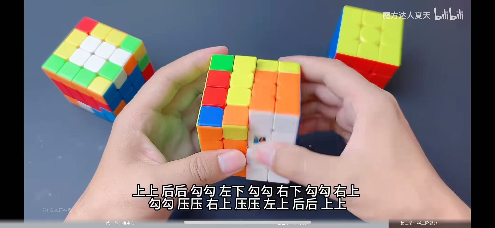
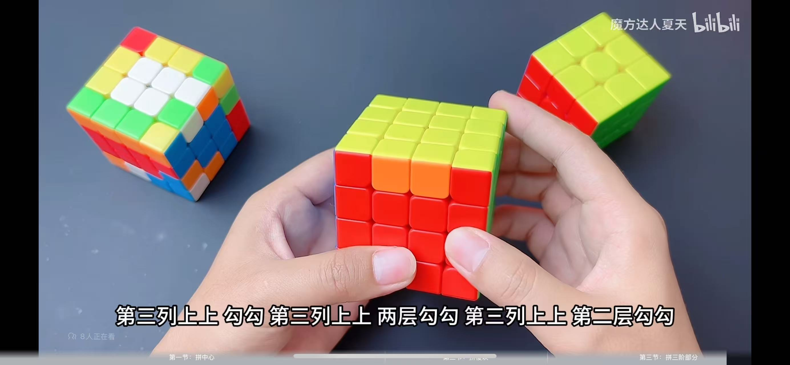

# 4阶魔方教程

## 普通还原教程

### 6个面中心块

6个面中心4个块，要先统一颜色
公式为 上勾下，或者是 上上勾下下
要求是 上下都是操作两列，勾是第一层，右下角是要填充的颜色，左上角是要归位的颜色
还要注意几个面的颜色，蓝底红前，左黄右白，上绿后橙

### 棱块

棱块也要统一颜色，如果棱块不处于同一水平线，公式为，上勾下压，下提上
如果处于同一水平面，则先两层回，再上勾下压，下提上，最后两层勾

### 按照三阶还原

之后按照三阶还原就可以了，有一些特殊情况
比如黄色十字，遇到黄色十字特殊情况，公式如下图所示

比如最后一步还原，棱块需要互换位置，如果对过棱块直接面向自己，如果是相邻的，一个面对自己一个朝右，公式如下图所示

## 520教程

### 白色朝下 红色对着自己 蓝色靠左

- 上面1层勾2下
- 中间2列上2下
- 上面1层勾2下
- 中间2列上2下

### 魔方整体顺时针方向转动 （绿色对着自己 黄色朝上）
- 上面1层勾2下
- 中间2列上2下
- 上面1层勾2下
- 中间2列上2下
- 中间2列下1下
- 中间2层勾2下
- 中间2列上1下
- 中间2层勾2下

### 魔方整体逆时针转一下 （主要红色对着自己 黄色朝上）
- 第2列下来2下
- 前面压1下
- 第3列下来2下
- 前面提1下
- 第2列下来2下
- 前面压1下
- 第3列下来2下
- 前面提1下
- 第3列下来2下
- 前面压1下
- 第2列下来2下
- 前面提1下
- 第3列下来2下
- 前面压1下
- 第2列下来2下
- 前面提1下

### 魔方整体顺时针转动一下 （蓝色中间绿色两边对着自己， 黄色朝上）
- 第3列下来2下
- 前面提1下
- 第2列下来2下
- 前面压1下
- 第3列下来2下
- 前面提1下
- 第2列下来2下
- 前面压1下
- 第2列下来2下
- 前面提1下
- 第3列下来2下
- 前面压1下
- 第2列下来2下
- 前面提1下
- 第3列下来2下
- 前面压1下

